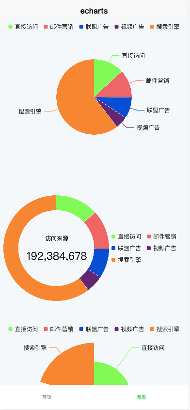
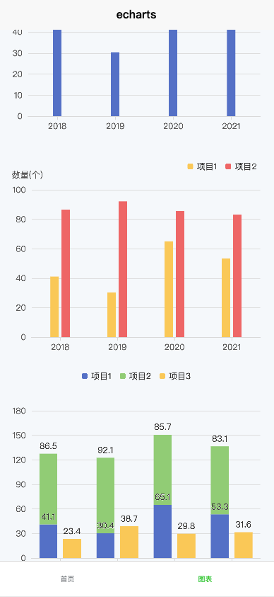

# echarts在uniapp中的使用




## 1. 安装lime-echarts插件

- 在uniapp插件市场中找到lime-echarts插件，并按照插件的说明进行安装。
- 将插件重的l-echart文件夹提取出来放到自己项目的components组件文件夹下，后续使用

## 2. 安装echarts库


- 在uniapp项目中安装echarts库，可以使用npm或yarn或pnpm进行安装。
- 使用命令 `npm/yarn/pnpm install echarts --save`安装echarts库。

## 3. 封装一个chart组件

- 在components文件夹下创建一个chart组件，用于封装echarts图表。
- 在chart组件中引入l-echarts插件和echarts库，echarts库通过按需加载减少代码量

chart组件，原理和pc相似，可查看上一篇文档
```vue
<template>
  <view style="height: inherit; position: relative;">
  	<l-echart ref="chartRef" @finished="init"></l-echart>
  </view>
</template>

<script setup lang="ts">
// nvue 不需要引入
// 使用按需引入 减小体积，暂时只有柱状图和饼图，如果新加类型，请重新引入图表
// 此组件原理：使用uniapp插件---lime-chart中的l-chart组件，此文件已经处理了多端展示echart（使用canvas等），echarts官网也提供了小程序的demo，就是用canvas渲染，所以我们只需要用这个组件，其他的配置完全就可以按照echarts配置来使用
// 所以再封装这个chart组件，只需要传入option配置即可

import { ref, watch } from 'vue'
// 引入echarts核心模块，核心模块提供了echarts使用的必须要的接口
import * as echarts from 'echarts/core'
// 引入柱状图图表，图表后缀都为Chart
import { BarChart, PieChart } from 'echarts/charts'
// 引入提示框，标题，直角坐标系，数据集，内置数据转换器组件，组件后缀都为Component
import { TitleComponent, TooltipComponent, GridComponent, DatasetComponent, TransformComponent, LegendComponent } from 'echarts/components'
// 标签自动布局，全局过渡动画等特性
import { LabelLayout, UniversalTransition } from 'echarts/features'
// 引入Canvas渲染器，注意引入CanvasRender 或者 SVGRender 是必须的一步，否则无法渲染
import { CanvasRenderer } from 'echarts/renderers'

// 注册必须的组件
echarts.use([
    TitleComponent,
    TooltipComponent,
    GridComponent,
    DatasetComponent,
    TransformComponent,
    LegendComponent,
    BarChart,
    PieChart,
    CanvasRenderer,
    LabelLayout,
    UniversalTransition
])

const props = defineProps({
  chartOption: {
    type: Object || null,
    required: true
  }
})

const chartRef = ref()

watch(() => props.chartOption, () => {
  chartRef.value?.setOption(props.chartOption)
}, {
  deep: true
})

const init = () => {
  if (!chartRef.value) return
  chartRef.value.init(echarts, (val: any) => {
    val.setOption(props.chartOption)
  })
}
</script>

```
## 4. 根据不同类型封装
- 柱状图

options.ts
```ts
import type { ComposeOption } from 'echarts/core'
import type { BarSeriesOption, DatasetComponentOption } from 'echarts'
import type {
  GridComponentOption,
  LegendComponentOption,
  TooltipComponentOption
} from 'echarts/components'
import type { OptionDataItemOriginal, OptionDataValue, OptionSourceData } from 'echarts/types/src/util/types'

/**
 * 柱状图Option
 */
export type BarOption = ComposeOption<BarSeriesOption | TooltipComponentOption | GridComponentOption | DatasetComponentOption | LegendComponentOption>

export interface BarDataOptions {
  source?: OptionSourceData<OptionDataValue, OptionDataItemOriginal<OptionDataValue>>
  barWidth?: number,
  color?: string[],
  legendShow?: boolean,
  legendPosition?: {
    top?: string | number,
    left?: string | number,
    right?: string | number,
    bottom?: string | number
  },
  legendWidth?: number | string,
  legendHeight?: number | string,
  itemLabel?: boolean,
  gridPosition?: {
    top?: string | number,
    left?: string | number,
    right?: string | number,
    bottom?: string | number
  },
  stack?: string[],
  yAxisName?: string,
  unit?: string
}
export function getOptions(data: BarDataOptions): BarOption {


  const getSeries = () => {
    let series: Array<BarSeriesOption> = []
    if (data.source) {
      for (let i = 1; i < data.source.length; i++) {
        series.push({
          type: 'bar',
          seriesLayoutBy: 'row',
          barWidth: data.barWidth,
          barGap: 0.3,
          itemStyle: {
            color: data.color?.[i - 1]
          },
          label: {
            show: data.itemLabel,
            position: 'top'
          },
          stack: data.stack?.[i - 1]
        })
      }
    }
    return series
  }


  return {
    legend: {
      show: data.legendShow,
      top: data.legendPosition?.top,
      left: data.legendPosition?.right ? undefined : data.legendPosition?.left || 'center',
      right: data.legendPosition?.right,
      bottom: data.legendPosition?.bottom,
      width: data.legendWidth || 'auto',
      height: data.legendHeight || 'auto',
      itemWidth: 8,
      itemHeight: 8,
      itemGap: 12,
      borderWidth: 0,
      itemStyle: {
        borderWidth: 0
      }
    },
    tooltip: {
      trigger: 'axis',
      axisPointer: {  // 坐标轴指示器，坐标轴触发有效
        type: 'shadow',
        label: {
          show: true,
          backgroundColor: 'rgba(0,0,0,0.7)'
        },
      },
      valueFormatter: (value) => `${value}${data.unit || ''}`
    },
    grid: {
      top: data.gridPosition?.top || 60,
      left: data.gridPosition?.left || '5%',
      right: data.gridPosition?.right || '5%',
      bottom: data.gridPosition?.bottom || 24,
      containLabel: true,
    },
    dataset: {
      source: data.source
    },
    xAxis: [
      {
        type: 'category',
        axisLabel: { // 坐标轴刻度标签的相关设置。
          show: true,
          fontSize: 12,
          // padding: [8, 0, 0, 0],
          color: 'rgba(89, 89, 89, 1)' // 刻度标签颜色值
        },
        axisTick: { // 坐标轴刻度相关设置。
          show: true,
          alignWithLabel: true,
          lineStyle: {
            color: 'rgba(217, 217, 217, 1)' // 刻度线颜色值
          }
        },
        axisLine: { // 坐标轴轴线相关设置。
          lineStyle: {
            color: 'rgba(217, 217, 217, 1)' // 轴线的颜色
          }
        }
      },
    ],
    yAxis: [
      {
        type: 'value',
        name:  data.unit ? `${data.yAxisName}(${data.unit})` : data.yAxisName,
        nameTextStyle: { // 坐标轴名称的相关设置。
          color: 'rgba(89, 89, 89, 1)',
          fontSize: 12,
          padding: [0, data.unit ? 12 : 20, 0, 0]
        },
        axisLabel: { // 坐标轴刻度标签的相关设置。
          show: true,
          fontSize: 12,
          color: 'rgba(89, 89, 89, 1)' // 刻度标签颜色值
        },
        splitLine: {
          show: true,
          lineStyle: {
            color: '#ddd', // 分割线颜色值
            width: 0.5
          }
        },
        alignTicks: true
      }
    ],
    series: getSeries()
  }
}

```

BarChart.vue
```vue
<script setup lang="ts">

import { onMounted, ref, watch } from 'vue'
import Chart from '@/components/chart/chart.vue'
import type { BarDataOptions, BarOption } from './echarts.options'
import { getOptions }from './echarts.options'

const props = defineProps<{
  data: BarDataOptions
}>()

const options = ref<BarOption>({})

const renderData = () => {
  if (props.data && props.data.source) {
    options.value = getOptions(props.data)
  } else {
    options.value = {}
    console.log('props.data.source is undefined')
  }
}

watch(()=> props.data, () => {
  renderData()
}, { deep: true })

onMounted(() => {
  renderData()
})

</script>

<template>
  <div style="width: 100%; height: 100%; position: relative;">
    <Chart :chart-option="options" />
  </div>
</template>

<style scoped>

</style>

```

- 饼图

options.ts
```ts
import { scientificCounting } from '@/utils'
import type { ComposeOption } from 'echarts/core'
import type { PieSeriesOption } from 'echarts/charts'
import type {
  LegendComponentOption,
  TitleComponentOption,
  TooltipComponentOption
} from 'echarts/components'

/**
 *  饼图Option
 */
export type PieOption = ComposeOption<PieSeriesOption | TitleComponentOption | TooltipComponentOption  | LegendComponentOption>

export interface PieDataOptions {
  centerName?: string,
  unit?: string,
  /**
   * 颜色，顺序取值
   */
  color?: string[]
  /**
   * legend组件是否显示
   * 不显示的话，饼图位置居中
   * 显示的话, 饼图位置请自定义，可不填，默认值: ['50%', '50%']
   */
  legendShow?: boolean
  /**
   * 饼图数据
   */
  dataArr: {name: string, value: number}[]
  /**
   * 饼图的半径
   * number：直接指定外半径值
   * string：例如，'20%'，表示外半径为可视区尺寸（容器高宽中较小一项）的 20% 长度。
   * Array.<number|string>：数组的第一项是内半径，第二项是外半径。每一项遵从上述 number string 的描述。
   */
  radius?: string | number | (string | number)[]
  /**
   * 饼图的原点，即配置中的series.center
   */
  pieCenter?: string | number | (string | number)[],
  /**
   * 南丁格尔玫瑰图
   */
  roseType?: 'radius' | 'area',
  /**
   * 饼图的文本标签是否展示
   */
  labelShow?: boolean,
  legendPosition?: {
    top?: string | number,
    left?: string | number,
    right?: string | number,
    bottom?: string | number
  },
  legendWidth?: number | string,
  legendHeight?: number | string,
  centerNamePosition?: {
    left?: string | number,
    top?: string | number,
  },
  sum?: number,
  showSum?: boolean,
  sumPosition?: {
    left?: string | number,
    top?: string | number,
  }
}

export function getOptions(data: PieDataOptions): PieOption {

  const getSum = () => {
    return data.dataArr.reduce((pre, cur) => pre + cur.value, 0).toString()
  }
  return {
    color: data.color,
    title: [
      {
        text: data.centerName ? `${data.centerName}${data.unit ? `(${data.unit})` : ''}` : '',
        textAlign: 'center',
        left: data.centerNamePosition?.left || 'center',
        top: data.centerNamePosition?.top || 'center',
        textStyle: {
          color: 'rgba(0, 0, 0, 1)',
          fontSize: 12,
          fontWeight: 'normal',
        }
      },
      {
        text: data.sum ? scientificCounting(data.sum) : data.showSum ? getSum() : '',
        textAlign: 'center',
        left: data.sumPosition?.left || 'center',
        top: data.sumPosition?.top || 'center',
        textStyle: {
          color: 'rgba(18, 18, 18, 1)',
          fontSize: 22,
          fontWeight: 600,
        }
      }
    ],
    legend: {
      show: data.legendShow,
      top: data.legendPosition?.top,
      left: data.legendPosition?.right ? undefined : data.legendPosition?.left || 'center',
      right: data.legendPosition?.right,
      bottom: data.legendPosition?.bottom,
      width: data.legendWidth || 'auto',
      height: data.legendHeight || 'auto',
      itemWidth: 8,
      itemHeight: 8,
      itemGap: 12,
      borderWidth: 0,
      itemStyle: {
        borderWidth: 0
      }
    },
    tooltip: {
      trigger: 'item',
      axisPointer: {
        type: 'shadow'
      }
    },
    series: {
      type: 'pie',
      center: !data.legendShow ? ['50%', '50%'] : (data.pieCenter || ['50%', '50%']),
      data: data.dataArr,
      radius: data.radius || [0, '50%'],
      roseType: data.roseType,
      itemStyle: {
        borderColor: '#fff',
        borderWidth: 0.5,
        // borderRadius: 5
      },
      label: {
        show: data.labelShow !== false,
        alignTo: 'none',
      },
      // labelLine: {
      //   length: 5,
      // },
      emphasis: {
        itemStyle: {
          shadowBlur: 10,
          shadowOffsetX: 0,
          shadowColor: 'rgba(0, 0, 0, 0.5)'
        }
      }
    }
  }
}

```

PieChart.vue

```vue
<script setup lang="ts">

import { onMounted, ref, watch } from 'vue'
import Chart from '@/components/chart/chart.vue'
import type { PieDataOptions, PieOption } from './echarts.options'
import { getOptions } from './echarts.options'

const props = defineProps<{
  data: PieDataOptions
}>()

const options = ref<PieOption>({})

const renderData = () => {
  if (props.data && props.data.dataArr) {
    options.value = getOptions(props.data)
  } else {
    options.value = {}
    console.log('props.data.dataArr is undefined')
  }
}

watch(()=> props.data, () => {
  renderData()
}, { deep: true })

onMounted(() => {
  renderData()
})

</script>

<template>
  <div style="width: 100%; height: 100%; position: relative;">
    <Chart :chart-option="options" />
  </div>
</template>

<style scoped>

</style>

```

## 5. 使用

只需要改变data的值就能重新绘制
```vue
<template>
  <view>
    <PieChart :data="data1" style="height: 600rpx; width: 100%;"></PieChart>
  </view>
  <view>
    <PieChart :data="data2" style="height: 600rpx; width: 100%;"></PieChart>
  </view>
  <view>
    <PieChart :data="data3" style="height: 600rpx; width: 100%;"></PieChart>
  </view>
  <view>
    <BarChart :data="data4" style="height: 600rpx; width: 100%;"></BarChart>
  </view>
  <view>
    <BarChart :data="data5" style="height: 600rpx; width: 100%;"></BarChart>
  </view>
  <view>
    <BarChart :data="data6" style="height: 600rpx; width: 100%;"></BarChart>
  </view>
</template>

<script setup lang="ts">
import PieChart from '@/components/chartModules/PieChart/PieChart.vue'
import { ref } from 'vue'
import type { PieDataOptions } from '@/components/chartModules/PieChart/echarts.options'
import BarChart from '@/components/chartModules/BarChart/BarChart.vue'
import type { BarDataOptions } from '@/components/chartModules/BarChart/echarts.options'

const data1 = ref<PieDataOptions>({
  legendShow: true,
  color: ['#81fa58', '#ee6666', '#094cd5', '#642673', '#ff8632'],
  dataArr: [
    { value: 335, name: '直接访问' },
    { value: 310, name: '邮件营销' },
    { value: 234, name: '联盟广告' },
    { value: 135, name: '视频广告' },
    { value: 1548, name: '搜索引擎' },
  ]
})
const data2 = ref<PieDataOptions>({
  color: ['#81fa58', '#ee6666', '#094cd5', '#642673', '#ff8632'],
  legendShow: true,
  centerName: '访问来源',
  centerNamePosition: {
    left: '29%',
    top: '40%',
  },
  sum: 192384678,
  sumPosition: {
    left: '29%',
    top: '50%',
  },
  dataArr: [
    { value: 335, name: '直接访问' },
    { value: 310, name: '邮件营销' },
    { value:  234, name: '联盟广告' },
    { value: 135, name: '视频广告' },
    { value: 1548, name: '搜索引擎' },
  ],
  radius: ['50%', '70%'],
  labelShow: false,
  legendPosition: {
    right: 20,
    top: 'center',
  },
  legendWidth: '40%',
  pieCenter: ['30%', '50%']
})
const data3 = ref<PieDataOptions>({
  color: ['#81fa58', '#ee6666', '#094cd5', '#642673', '#ff8632'],
  legendShow: true,
  dataArr: [
    { value: 335, name: '直接访问' },
    { value: 310, name: '邮件营销' },
    { value: 234, name: '联盟广告' },
    { value: 135, name: '视频广告' },
    { value: 548, name: '搜索引擎' },
  ],
  radius: ['10%', '75%'],
  labelShow: true,
  roseType: 'area',
})
const data4 = ref<BarDataOptions>({
  source: [
    ['项目', '2018', '2019', '2020', '2021'],
    ['项目1', 41.1, 30.4, 65.1, 53.3],
  ],
  barWidth: 12,
})
const data5 = ref<BarDataOptions>({
  legendShow: true,
  source: [
    ['项目', '2018', '2019', '2020', '2021'],
    ['项目1', 41.1, 30.4, 65.1, 53.3],
    ['项目2', 86.5, 92.1, 85.7, 83.1]
  ],
  barWidth: 12,
  color: ['#fac858', '#ee6666'],
  legendPosition: {
    right: '5%',
    top: 16
  },
  yAxisName: '数量',
  unit: '个'
})
const data6 = ref<BarDataOptions>({
  legendShow: true,
  source: [
    ['项目', '2018', '2019', '2020', '2021'],
    ['项目1', 41.1, 30.4, 65.1, 53.3],
    ['项目2', 86.5, 92.1, 85.7, 83.1],
    ['项目3', 23.4, 38.7, 29.8, 31.6],
  ],
  stack: ['x', 'x', 'y'],
  itemLabel: true
})
</script>


<style scoped lang="scss">

</style>

```
