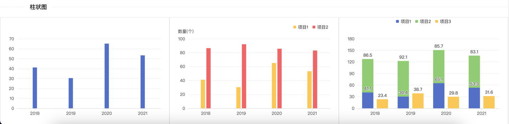

# 柱状图组件
- 只专注于柱状图表，可以一列，堆叠，分组等。
- 文件包括一个vue组件一个options.ts配置文件

## 1. BarChart组件

```vue
<script setup lang="ts">

import ChartType from '@/components/ChartType.vue'
import { BarDataOptions, BarOption, getOptions } from './echarts.options'
import { onMounted, ref, watch } from 'vue'

const props = defineProps<{
  data: BarDataOptions
}>()

const options = ref<BarOption>()

const renderData = () => {
  if (props.data && props.data.source) {
    options.value = getOptions(props.data)
  } else {
    options.value = {}
    console.log('props.data.source is undefined')
  }
}

watch(()=> props.data, () => {
  renderData()
}, { deep: true })

onMounted(() => {
  renderData()
})

</script>

<template>
  <div style="width: 100%; height: 100%; position: relative;">
    <ChartType :options="options" />
  </div>
</template>

<style scoped>

</style>

```
## 2. options.ts文件
```ts
import { ComposeOption } from 'echarts/core'
import { BarSeriesOption, DatasetComponentOption } from 'echarts'
import {
  GridComponentOption,
  LegendComponentOption,
  TooltipComponentOption
} from 'echarts/components'
import { OptionDataItemOriginal, OptionDataValue, OptionSourceData } from 'echarts/types/src/util/types'

/**
 * 柱状图Option
 */
export type BarOption = ComposeOption<BarSeriesOption | TooltipComponentOption | GridComponentOption | DatasetComponentOption | LegendComponentOption>

export interface BarDataOptions {
  source?: OptionSourceData<OptionDataValue, OptionDataItemOriginal<OptionDataValue>>
  barWidth?: number,
  color?: string[],
  legendShow?: boolean,
  legendPosition?: {
    top?: string | number,
    left?: string | number,
    right?: string | number,
    bottom?: string | number
  },
  legendWidth?: number | string,
  legendHeight?: number | string,
  itemLabel?: boolean,
  gridPosition?: {
    top?: string | number,
    left?: string | number,
    right?: string | number,
    bottom?: string | number
  },
  stack?: string[],
  yAxisName?: string,
  unit?: string
}
export function getOptions(data: BarDataOptions): BarOption {


  const getSeries = () => {
    let series: Array<BarSeriesOption> = []
    if (data.source) {
      for (let i = 1; i < data.source.length; i++) {
        series.push({
          type: 'bar',
          seriesLayoutBy: 'row',
          barWidth: data.barWidth,
          barGap: 0.3,
          itemStyle: {
            color: data.color?.[i - 1]
          },
          label: {
            show: data.itemLabel,
            position: 'top'
          },
          stack: data.stack?.[i - 1]
        })
      }
    }
    return series
  }


  return {
    legend: {
      show: data.legendShow,
      top: data.legendPosition?.top,
      left: data.legendPosition?.right ? undefined : data.legendPosition?.left || 'center',
      right: data.legendPosition?.right,
      bottom: data.legendPosition?.bottom,
      width: data.legendWidth || 'auto',
      height: data.legendHeight || 'auto',
      itemWidth: 8,
      itemHeight: 8,
      itemGap: 12,
      borderWidth: 0,
      itemStyle: {
        borderWidth: 0
      }
    },
    tooltip: {
      trigger: 'axis',
      axisPointer: {  // 坐标轴指示器，坐标轴触发有效
        type: 'shadow',
        label: {
          show: true,
          backgroundColor: 'rgba(0,0,0,0.7)'
        },
      },
      valueFormatter: (value) => `${value}${data.unit || ''}`
    },
    grid: {
      top: data.gridPosition?.top || 60,
      left: data.gridPosition?.left || '5%',
      right: data.gridPosition?.right || '5%',
      bottom: data.gridPosition?.bottom || 24,
      containLabel: true,
    },
    dataset: {
      source: data.source
    },
    xAxis: [
      {
        type: 'category',
        axisLabel: { // 坐标轴刻度标签的相关设置。
          show: true,
          fontSize: 12,
          // padding: [8, 0, 0, 0],
          color: 'rgba(89, 89, 89, 1)' // 刻度标签颜色值
        },
        axisTick: { // 坐标轴刻度相关设置。
          show: true,
          alignWithLabel: true,
          lineStyle: {
            color: 'rgba(217, 217, 217, 1)' // 刻度线颜色值
          }
        },
        axisLine: { // 坐标轴轴线相关设置。
          lineStyle: {
            color: 'rgba(217, 217, 217, 1)' // 轴线的颜色
          }
        }
      },
    ],
    yAxis: [
      {
        type: 'value',
        name:  data.unit ? `${data.yAxisName}(${data.unit})` : data.yAxisName,
        nameTextStyle: { // 坐标轴名称的相关设置。
          color: 'rgba(89, 89, 89, 1)',
          fontSize: 12,
          padding: [0, data.unit ? 12 : 20, 0, 0]
        },
        axisLabel: { // 坐标轴刻度标签的相关设置。
          show: true,
          fontSize: 12,
          color: 'rgba(89, 89, 89, 1)' // 刻度标签颜色值
        },
        splitLine: {
          show: true,
          lineStyle: {
            color: '#ddd', // 分割线颜色值
            width: 0.5
          }
        },
        alignTicks: true
      }
    ],
    series: getSeries()
  }
}

```
## 3. 实现思路
1. 在`onMounted`钩子中，初始化`options`的值。
2. 在`watchEffect`中，监听`props.data`的变化，当数据发生变化时，重新计算`options`的值。
3. 使用`ChartType`组件，传入options，实现图表的展示。

## 4. 使用方式


```vue
<template>
  <a-divider orientation="left">柱状图</a-divider>
  <a-row>
    <a-col :xs="24" :sm="24" :md="12" :lg="12" :xl="8">
      <BarChart :data="data4" style="height: 300px; width: 100%;"></BarChart>
    </a-col>
    <a-col :xs="24" :sm="24" :md="12" :lg="12" :xl="8">
      <BarChart :data="data5" style="height: 300px; width: 100%;"></BarChart>
    </a-col>
    <a-col :xs="24" :sm="24" :md="12" :lg="12" :xl="8">
      <BarChart :data="data6" style="height: 300px; width: 100%;"></BarChart>
    </a-col>
  </a-row>
</template>

<script setup lang="ts">
  import { ref } from 'vue'
  import BarChart from '@/components/chartModules/BarChart/BarChart.vue'
  import { BarDataOptions } from '@/components/chartModules/BarChart/echarts.options'

  const data4 = ref<BarDataOptions>({
    source: [
      ['项目', '2018', '2019', '2020', '2021'],
      ['项目1', 41.1, 30.4, 65.1, 53.3],
    ],
    barWidth: 12,
  })
  const data5 = ref<BarDataOptions>({
    legendShow: true,
    source: [
      ['项目', '2018', '2019', '2020', '2021'],
      ['项目1', 41.1, 30.4, 65.1, 53.3],
      ['项目2', 86.5, 92.1, 85.7, 83.1]
    ],
    barWidth: 12,
    color: ['#fac858', '#ee6666'],
    legendPosition: {
      right: '5%',
      top: 16
    },
    yAxisName: '数量',
    unit: '个'
  })
  const data6 = ref<BarDataOptions>({
    legendShow: true,
    source: [
      ['项目', '2018', '2019', '2020', '2021'],
      ['项目1', 41.1, 30.4, 65.1, 53.3],
      ['项目2', 86.5, 92.1, 85.7, 83.1],
      ['项目3', 23.4, 38.7, 29.8, 31.6],
    ],
    stack: ['x', 'x', 'y'],
    itemLabel: true
  })
</script>
```

- 改变data内容，图表将自动刷新
- 注意：图表的高度必须指定


## 5. 配置项


| 属性             | 类型                                                                                                                      | 默认值                                          | 说明                   |
|----------------|-------------------------------------------------------------------------------------------------------------------------|----------------------------------------------|----------------------|
| source         | \(number &#124; string\)\[\]\[\]                                                                                        | -                                            | 图表数据源，必填             |
| color          | string\[\]                                                                                                              | -                                            | 图例颜色                 |
| legendShow     | boolean                                                                                                                 | false                                        | 图例是否显示               |
| legendPosition | \{top?: string &#124; number,left?: string &#124; number, right?: string &#124; number, bottom?: string &#124; number\} | -                                            | 图例位置, 有right时left不生效 |
| legendWidth    | number &#124; string                                                                                                    | -                                            | 图例宽度                 |
| legendHeight   | number &#124; string                                                                                                    | -                                            | 图例高度                 |
| yAxisName      | string                                                                                                                  | -                                            | y轴名称                 |
| unit           | string                                                                                                                  | -                                            | y轴单位                 |
| barWidth       | number                                                                                                                  | -                                            | 柱状图宽度                |
| stack          | string\[\]                                                                                                              | -                                            | 堆叠图                  |
| itemLabel      | boolean                                                                                                                 | false                                        | 柱状图是否显示数值            |
| gridPosition   | \{top?: string &#124; number,left?: string &#124; number, right?: string &#124; number, bottom?: string &#124; number\} | top: 60, right: '5%', left: '5%', bottom: 24 |                      | 图表位置                 |


