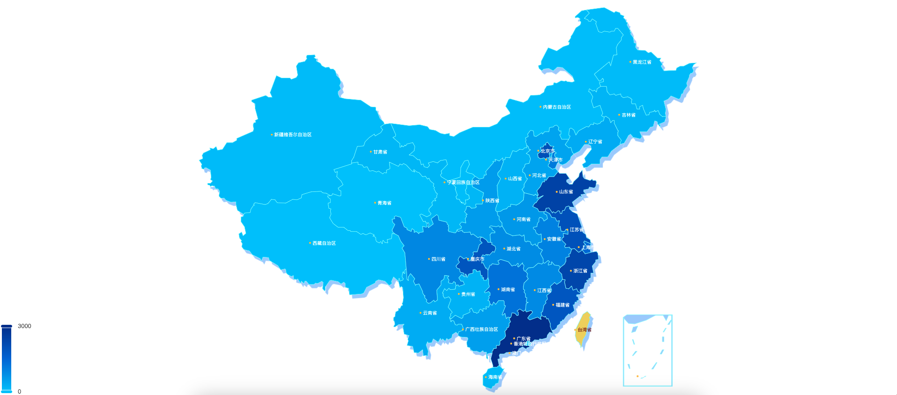

# Echarts 地图组件

- 只专注于地图类型。
- 文件包括一个vue组件一个options.ts配置文件。

## 1. 效果




## 2. MapChart组件

```vue
<template>
  <chart-type :options="options"></chart-type>
</template>

<script setup lang="ts">
import * as echarts from 'echarts'
import ChartType from '@/components/ChartType.vue'
import { onMounted, ref, watch } from 'vue'
import { getOptions, MapOption, MapDataOptions } from '@/components/chartModules/MapChart/echarts.options'

const props = defineProps<{
  data: MapDataOptions
}>()
const options = ref<MapOption>()

const renderData = () => {
  echarts.registerMap(props.data.mapName, { geoJSON: props.data.mapJson })
  options.value = getOptions(props.data)
}

watch(()=> props.data, () => {
  renderData()
}, { deep: true })

onMounted(() => {
  renderData()
})
</script>

<style scoped>

</style>

```

## 3. options.ts文件

```ts
import { ComposeOption } from 'echarts/core'
import { MapSeriesOption, GeoComponentOption, VisualMapComponentOption } from 'echarts'
import {
  TooltipComponentOption
} from 'echarts/components'


/**
 * 地图option
 */
export type MapOption = ComposeOption<MapSeriesOption | TooltipComponentOption | GeoComponentOption | VisualMapComponentOption>

export interface MapDataOptions {
  mapJson: unknown
  mapName: string
  seriesData: any[],
  seriesName: string,
  nameProperty?: string
  pieces?: any[],
  zoom?: number,
  min?: number,
  max?: number,
  color: string[],
  baseColor: string,
  borderColor: string,
  labelColor?: string,
  labelFontSize?: string,
}

export function getOptions(data: MapDataOptions): MapOption {

  return {
    tooltip: {
      show: true
    },
    visualMap: {
      min: data.min,
      max: data.max,
      calculable: true,
      inRange: {
        color: data.color
      },
      showLabel: true,
      pieces: data.pieces,
    },
    geo: [{
      map: data.mapName,
      zoom: data.zoom,
      zlevel: 5,
      label: {
        show: true,
        fontSize: data.labelFontSize || '10',
        color: data.labelColor || '#fff',
        formatter(params) {
          return '{dot|} ' + params.name
        },
        rich: {
          dot: {
            height: 4,
            width: 4,
            borderRadius: 2,
            backgroundColor: '#ffc441'
          }
        }
      },
      itemStyle: {
        borderWidth: 1,
        borderColor: data.borderColor,
        areaColor: data.baseColor,
      }
    },
    {
      map: data.mapName,
      zoom: data.zoom,
      zlevel: 4,
      label: {
        show: false
      },
      itemStyle: {
        borderWidth: 1,
        borderColor: 'transparent',
        areaColor: data.baseColor,
        shadowColor: data.baseColor,
        shadowOffsetX: 6,
        shadowOffsetY: 8,
        shadowBlur: 1
      },
      regions: [
        {
          name: "南海诸岛",
          itemStyle: {
            opacity: 0
          },
          label: {
            show: false // 隐藏文字
          }
        }
      ],
    }],
    series: {
      name: data.seriesName,
      type: 'map',
      map: data.mapName,
      data: data.seriesData,
      geoIndex: 0,
      label: {
        show: true
      }
    },
  }
}

```

## 4. 使用方式

```vue
<template>
  <div class="echarts-map">
    <map-chart :data="mapDataOptions" />
  </div>
</template>

<script setup lang="ts">
import MapChart from '@/components/chartModules/MapChart/MapChart.vue'
import { onMounted, reactive } from 'vue'
import { MapDataOptions } from '@/components/chartModules/MapChart/echarts.options'
import ChinaMapJson from '@/assets/mapJson/china.map.json'
const data = [
  {
    "regionType": null,
    "regionCode": "120000",
    "regionName": "天津市",
    "projectTotal": 1134,
    "policyTotal": null,
    "deptTotal": null,
    "regionStatistics": null
  },
  {
    "regionType": null,
    "regionCode": "110000",
    "regionName": "北京市",
    "projectTotal": 2046,
    "policyTotal": null,
    "deptTotal": null,
    "regionStatistics": null
  },
  {
    "regionType": null,
    "regionCode": "310000",
    "regionName": "上海市",
    "projectTotal": 1448,
    "policyTotal": null,
    "deptTotal": null,
    "regionStatistics": null
  },
  {
    "regionType": null,
    "regionCode": "500000",
    "regionName": "重庆市",
    "projectTotal": 1910,
    "policyTotal": null,
    "deptTotal": null,
    "regionStatistics": null
  },
  {
    "regionType": null,
    "regionCode": "460000",
    "regionName": "海南省",
    "projectTotal": 107,
    "policyTotal": null,
    "deptTotal": null,
    "regionStatistics": null
  },
  {
    "regionType": null,
    "regionCode": "130000",
    "regionName": "河北省",
    "projectTotal": 433,
    "policyTotal": null,
    "deptTotal": null,
    "regionStatistics": null
  },
  {
    "regionType": null,
    "regionCode": "220000",
    "regionName": "吉林省",
    "projectTotal": 187,
    "policyTotal": null,
    "deptTotal": null,
    "regionStatistics": null
  },
  {
    "regionType": null,
    "regionCode": "140000",
    "regionName": "山西省",
    "projectTotal": 214,
    "policyTotal": null,
    "deptTotal": null,
    "regionStatistics": null
  },
  {
    "regionType": null,
    "regionCode": "520000",
    "regionName": "贵州省",
    "projectTotal": 225,
    "policyTotal": null,
    "deptTotal": null,
    "regionStatistics": null
  },
  {
    "regionType": null,
    "regionCode": "420000",
    "regionName": "湖北省",
    "projectTotal": 832,
    "policyTotal": null,
    "deptTotal": null,
    "regionStatistics": null
  },
  {
    "regionType": null,
    "regionCode": "150000",
    "regionName": "内蒙古自治区",
    "projectTotal": 47,
    "policyTotal": null,
    "deptTotal": null,
    "regionStatistics": null
  },
  {
    "regionType": null,
    "regionCode": "350000",
    "regionName": "福建省",
    "projectTotal": 1879,
    "policyTotal": null,
    "deptTotal": null,
    "regionStatistics": null
  },
  {
    "regionType": null,
    "regionCode": "540000",
    "regionName": "西藏自治区",
    "projectTotal": 14,
    "policyTotal": null,
    "deptTotal": null,
    "regionStatistics": null
  },
  {
    "regionType": null,
    "regionCode": "430000",
    "regionName": "湖南省",
    "projectTotal": 1265,
    "policyTotal": null,
    "deptTotal": null,
    "regionStatistics": null
  },
  {
    "regionType": null,
    "regionCode": "810000",
    "regionName": "香港特别行政区",
    "projectTotal": 0,
    "policyTotal": null,
    "deptTotal": null,
    "regionStatistics": null
  },
  {
    "regionType": null,
    "regionCode": "330000",
    "regionName": "浙江省",
    "projectTotal": 2316,
    "policyTotal": null,
    "deptTotal": null,
    "regionStatistics": null
  },
  {
    "regionType": null,
    "regionCode": "820000",
    "regionName": "澳门特别行政区",
    "projectTotal": 0,
    "policyTotal": null,
    "deptTotal": null,
    "regionStatistics": null
  },
  {
    "regionType": null,
    "regionCode": "370000",
    "regionName": "山东省",
    "projectTotal": 2417,
    "policyTotal": null,
    "deptTotal": null,
    "regionStatistics": null
  },
  {
    "regionType": null,
    "regionCode": "320000",
    "regionName": "江苏省",
    "projectTotal": 2008,
    "policyTotal": null,
    "deptTotal": null,
    "regionStatistics": null
  },
  {
    "regionType": null,
    "regionCode": "360000",
    "regionName": "江西省",
    "projectTotal": 854,
    "policyTotal": null,
    "deptTotal": null,
    "regionStatistics": null
  },
  {
    "regionType": null,
    "regionCode": "210000",
    "regionName": "辽宁省",
    "projectTotal": 329,
    "policyTotal": null,
    "deptTotal": null,
    "regionStatistics": null
  },
  {
    "regionType": null,
    "regionCode": "630000",
    "regionName": "青海省",
    "projectTotal": 0,
    "policyTotal": null,
    "deptTotal": null,
    "regionStatistics": null
  },
  {
    "regionType": null,
    "regionCode": "230000",
    "regionName": "黑龙江省",
    "projectTotal": 88,
    "policyTotal": null,
    "deptTotal": null,
    "regionStatistics": null
  },
  {
    "regionType": null,
    "regionCode": "450000",
    "regionName": "广西壮族自治区",
    "projectTotal": 515,
    "policyTotal": null,
    "deptTotal": null,
    "regionStatistics": null
  },
  {
    "regionType": null,
    "regionCode": "410000",
    "regionName": "河南省",
    "projectTotal": 643,
    "policyTotal": null,
    "deptTotal": null,
    "regionStatistics": null
  },
  {
    "regionType": null,
    "regionCode": "640000",
    "regionName": "宁夏回族自治区",
    "projectTotal": 31,
    "policyTotal": null,
    "deptTotal": null,
    "regionStatistics": null
  },
  {
    "regionType": null,
    "regionCode": "340000",
    "regionName": "安徽省",
    "projectTotal": 986,
    "policyTotal": null,
    "deptTotal": null,
    "regionStatistics": null
  },
  {
    "regionType": null,
    "regionCode": "610000",
    "regionName": "陕西省",
    "projectTotal": 567,
    "policyTotal": null,
    "deptTotal": null,
    "regionStatistics": null
  },
  {
    "regionType": null,
    "regionCode": "650000",
    "regionName": "新疆维吾尔自治区",
    "projectTotal": 83,
    "policyTotal": null,
    "deptTotal": null,
    "regionStatistics": null
  },
  {
    "regionType": null,
    "regionCode": "620000",
    "regionName": "甘肃省",
    "projectTotal": 158,
    "policyTotal": null,
    "deptTotal": null,
    "regionStatistics": null
  },
  {
    "regionType": null,
    "regionCode": "530000",
    "regionName": "云南省",
    "projectTotal": 322,
    "policyTotal": null,
    "deptTotal": null,
    "regionStatistics": null
  },
  {
    "regionType": null,
    "regionCode": "440000",
    "regionName": "广东省",
    "projectTotal": 7614,
    "policyTotal": null,
    "deptTotal": null,
    "regionStatistics": null
  },
  {
    "regionType": null,
    "regionCode": "510000",
    "regionName": "四川省",
    "projectTotal": 910,
    "policyTotal": null,
    "deptTotal": null,
    "regionStatistics": null
  },
  {
    "regionType": null,
    "regionCode": "710000",
    "regionName": "台湾省",
    "projectTotal": 0,
    "policyTotal": null,
    "deptTotal": null,
    "regionStatistics": null
  }
]

const mapDataOptions = reactive<MapDataOptions>({
  mapName: 'china',
  seriesName: '政策数量',
  mapJson: ChinaMapJson,
  seriesData: [],
  min: 0,
  max: 3000,
  zoom: 1.2,
  color: ['#00c7ff','#006edd', '#003399'],
  baseColor: '#A8CFFF',
  borderColor: '#9ff7ff',
})

onMounted(() => {
  mapDataOptions.seriesData = data.map(item => {
    return {
      name: item.regionName,
      value: item.projectTotal
    }
  })
})


</script>

<style scoped>
.echarts-map {
  width: 100vw;
  height: 100vh;
}
</style>

```

## 5. 配置项


| 属性             | 类型                                                                                                                      | 默认值                                          | 说明                   |
|----------------|-------------------------------------------------------------------------------------------------------------------------|----------------------------------------------|----------------------|
| mapJson         | JSON                                                                                       | -                                            | 地图轮廓坐标点 ，必传            |
| mapName          | string                                                                                                             | -                                            | 地图名称  ，必填               |
| seriesData     | any[]                                                                                                                 | -                                        | 数据，必填               |
| seriesName | string | -                                            | 数据名称， 必填 |
| zoom    | number                                                                                                   | -                                            | 缩放比例                 |
| min   | number                                                                                                    | -                                            | 最小值                 |
| max      | number                                                                                                                  | -                                            | 最大值                 |
| color           |  string\[\]               | -                                            | 颜色值，必填                 |
| baseColor       | string                                                                                                                  | -                                            | 底色，侧边颜色                |
| borderColor          | string                                                                                                            | -                                            | 边框颜色                  |
| labelColor      | string                                                                                                                 | #fff                                        | label颜色            |
| labelFontSize   | string |               10     | label字体大小                 |


