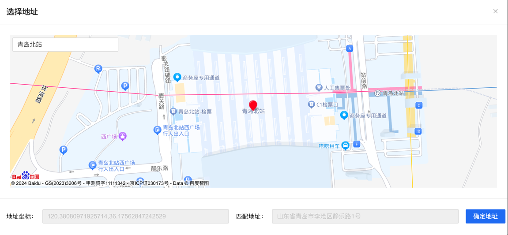

# 点选地址组件

## 介绍
通过封装百度地图的自动补全功能，搜索功能等，实现一个点选地址的组件。



## 组件代码
使用 element-plus组件布局
```vue
<template>
  <div class="choicePositionDialog">
    <el-dialog
      width="80%"
      v-model="dialogVisible"
      title="选择地址"
      :close-on-click-modal="false"
      draggable
      top="10vh"
      fit-input-width
      @opened="handleOpened"
    >
      <div id="choicePositionMap"></div>
      <el-autocomplete
        ref="autocompleteRef"
        style="position: absolute; top: 30px; left: 30px; z-index: 10; width: 240px;"
        v-model="searchValue"
        :trigger-on-focus="false"
        :fetch-suggestions="querySearch"
        clearable
        placeholder="请输入"
        @select="handleSelect"
      >
        <template #default="{ item }">
          <div class="value">{{ item.value }}<span style="font-size: 12px; color: rgba(0,0,0,0.45); margin-left: 12px;">{{ item.link }}</span></div>
        </template>
      </el-autocomplete>
      <template #footer>
        <div class="dialog-footer">
          <el-form :model="resultData">
            <el-row :gutter="16" style="margin-top: 16px;">
              <el-col :span="11">
                <el-form-item label="地址坐标：">
                  <el-input v-model="resultData.pointStr" disabled />
                </el-form-item>
              </el-col>

              <el-col :span="11">
                <el-form-item label="匹配地址：">
                  <el-input v-model="resultData.address" disabled />
                </el-form-item>
              </el-col>
              <el-col :span="2">
                <el-button type="primary" @click="ok" :disabled="!resultData.pointStr || !resultData.address">
                  确定地址
                </el-button>
              </el-col>
            </el-row>
          </el-form>

        </div>
      </template>
    </el-dialog>
  </div>

</template>

<script setup lang="ts">
import { IPoint, useMap } from '@/hooks/map'
import { ref } from 'vue'

const props = defineProps<{
  mapCenter: IPoint,
  initMarkerPoint: {
    address: string,
    lng: string,
    lat: string
  }
}>()
const emit = defineEmits(['confirm'])

const dialogVisible = ref(true)
const resultData = ref({
  address: '',
  lng: '',
  lat: '',
  pointStr: '',
  addressComponents: {
    city: '',
    district: '',
    street: '',
    streetNumber: ''
  }
})

const func = () => {
  // bdMap.value.setMapType(BMAP_SATELLITE_MAP)
  bdMap.value.enableScrollWheelZoom(true)
  autoCompleteHandle()
}
const { bdMap, BMapGL } = useMap('choicePositionMap', props.mapCenter, 11, func)

/**
 * 检索地址模块
 */
const searchValue = ref('')
const autocompleteRef = ref()
// 自动补全功能
const autoCompleteHandle = () => {
  new BMapGL.value.Autocomplete({
    input: autocompleteRef.value.inputRef.input,
    location: bdMap.value,
    onSearchComplete: (results: any) => {
      autocompleteRef.value.suggestions = results._pois.map((i: any) => {
        i.value = i.business
        i.link = i.province + i.city + i.district + i.street + i.streetNumber
        return i
      }).filter((item: any) => item.link !== '')
    }
  })
}
const querySearch = (queryString: string, callback: any) => {
  callback(autocompleteRef.value.suggestions)
}
const handleSelect = (item: any) => {
  const myValue = item.province + item.city + item.district + item.street + item.business
  handleLocalSearch(myValue)
}
/**
 * 根据地址搜索
 */
const handleLocalSearch = (str: string) => {
  const local = new BMapGL.value.LocalSearch(bdMap.value, {
    onSearchComplete: () => {
      const poi = local.getResults().getPoi(0)    //获取第一个智能搜索的结果
      addMarker(poi.point)
      resultData.value.address = poi.address
      resultData.value.lng = poi.point.lng
      resultData.value.lat = poi.point.lat
      resultData.value.pointStr = poi.point.lng + ',' + poi.point.lat
    }
  })
  local.search(str)
}
/**
 * 添加锚点
 * point 请传入百度地图Point实例
 */
const addMarker = (point: any) => {
  bdMap.value.clearOverlays()
  bdMap.value.centerAndZoom(point, 18)
  const marker = new BMapGL.value.Marker(point, {
    enableDragging: true
  })
  const geocoder = new BMapGL.value.Geocoder()
  geocoder.getLocation(point, (rs: any) => {
    resultData.value.addressComponents = rs.addressComponents
  })
  marker.addEventListener('dragend', () => {
    const poi = marker.getPosition()
    resultData.value.lng = poi.lng
    resultData.value.lat = poi.lat
    resultData.value.pointStr = poi.lng + ',' + poi.lat
    geocoder.getLocation(poi, (rs: any) => {
      console.log(rs)
      resultData.value.address = rs.address + rs.content?.poi_desc
      resultData.value.addressComponents = rs.addressComponents
    })
  })
  bdMap.value.addOverlay(marker)    //添加标注
}
const ok = () => {
  emit('confirm', resultData.value)
  dialogVisible.value = false
}

const handleOpened = () => {
  searchValue.value = ''
  resultData.value = {
    address: props.initMarkerPoint?.address || '',
    lng: props.initMarkerPoint?.lng || '',
    lat: props.initMarkerPoint?.lat || '',
    pointStr: props.initMarkerPoint?.lng ? props.initMarkerPoint?.lng + ',' + props.initMarkerPoint?.lat : '',
    addressComponents: {
      city: '',
      district: '',
      street: '',
      streetNumber: ''
    }
  }
  if (props.initMarkerPoint?.address && props.initMarkerPoint.lat && props.initMarkerPoint.lng) {
    const point = new BMapGL.value.Point(Number(props.initMarkerPoint.lng), Number(props.initMarkerPoint.lat))
    bdMap.value && addMarker(point)
  } else {
    bdMap.value.clearOverlays()
    bdMap.value.reset()
  }
}

defineExpose({dialogVisible})
</script>

<style scoped lang="scss">
.choicePositionDialog {
  :deep(.el-dialog) {
    height: 80%;
  }
  :deep(.el-dialog__body) {
    height: calc(100% - 57px - 83px);
    position: relative;
  }
}
#choicePositionMap {
  height: 100%;
  width: 100%;
}
</style>

```
## 使用

```vue

<template>
  <ChoicePosition ref="choicePositionRef" v-if="choicePositionShow" :map-center="mapCenter"
                  @confirm="choicePositionConfirm"
                  :init-marker-point="{ address: queryForm.address, lng: (queryForm.longitude as any), lat: (queryForm.latitude as any) }">
  </ChoicePosition>
</template>

<script setup lang="ts">
  import ChoicePosition from '@/components/choicePosition/index.vue'
  import { ref } from 'vue'
  import  { IPoint } from '@/hooks/map'

  // 地图中心点-青岛
  const mapCenter = ref<IPoint>({
    lng: 120.355173,
    lat: 36.082982
  })
  
  const queryForm = ref({
    longitude: '',
    latitude: '',
    address: ''
  })

  const choicePositionShow = ref(false)
  const choicePositionRef = ref()
  /**
   * 打开地图
   */
  const openMap = () => {
    choicePositionShow.value = true
    choicePositionRef.value && (choicePositionRef.value.dialogVisible = true)
  }

  const choicePositionConfirm = (data: { point: string, address: string, lng: number, lat: number }) => {
    queryForm.value.longitude = data.lng
    queryForm.value.latitude = data.lat
    queryForm.value.address = data.address
  }
</script>
```
## 思路
1. 通过使用百度地图的自动补全功能，用户可以输入关键字，自动查出与之相关地址列表
2. 用户选择其中一个地址后，通过检索功能查出相关经纬度，然后使用marker定位到该地址，并显示一个红色标记
3. 用户可以手动拖动标记，重新选择地址
4. 通过设置marker或移动marker时，获取详细地址，将省市区信息返回
