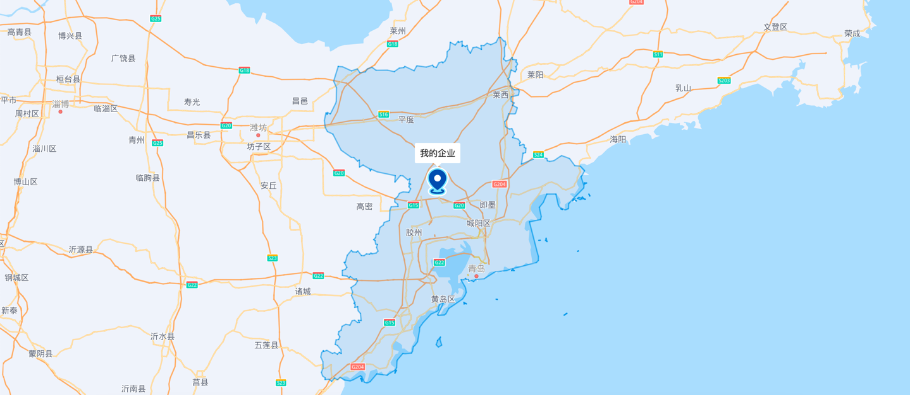

# 百度地图在vue中的使用

## 1. 获取百度地图key

1. 进入百度地图开放平台，注册账号并登录
2. 进入应用管理-我的应用，创建应用
3. 获取API Key

## 2. 在vue中异步方式引入百度地图

1. 封装百度地图hooks
```ts
import { onMounted, shallowRef } from 'vue'

export interface IPoint {
  lng: number | string,
  lat: number | string
}
interface Options {
  BMapGLLibFlag: boolean
}
/**
 * 返回地图相关内容
 * @param HTMLID 地图ID
 * @param point 地图中心坐标点（lng: 经度， lat: 纬度）
 * @param zoom 放大比例
 * @param callback 地图绘制完成之后的方法
 * @param options
 */
export function useMap(HTMLID: string, point: IPoint, zoom: number, callback: () => void, options: Options = { BMapGLLibFlag: false }) {
  /**
   * BMapGL
   */
  const BMapGL = shallowRef()
  /**
   * 当前地图对象Map
   */

  const bdMap = shallowRef()
  const BMapGLLib = shallowRef()

  /**
   * 加载百度地图api
   * @returns BMapGL
   */
  const loadBMapGL = () => {
    return new Promise((resolve) => {
      if (typeof (window as any).BMapGL !== 'undefined') {
        resolve((window as any).BMapGL)
        return
      }
      (window as any).onBMapGLCallback = function() {
        resolve((window as any).BMapGL)
      }
      const script = document.createElement('script')
      script.type = 'text/javascript'
      script.src = 'https://api.map.baidu.com/api?type=webgl&v=1.0&ak=你的百度key&callback=onBMapGLCallback'
      // script.onerror = reject
      document.body.appendChild(script)
    })
  }

  const loadBMapGLLib = () => {
    return new Promise((resolve) => {
      if (typeof (window as any).BMapGLLib !== 'undefined') {
        resolve((window as any).BMapGLLib)
        return
      }
      const script = document.createElement('script')
      script.type = 'text/javascript'
      script.src = 'https://mapopen.cdn.bcebos.com/github/BMapGLLib/DrawingManager/src/DrawingManager.min.js'
      script.onload = () => {
        const link = document.createElement('link');
        link.rel = 'stylesheet';
        link.href = 'https://mapopen.cdn.bcebos.com/github/BMapGLLib/DrawingManager/src/DrawingManager.min.css';
        link.onload = () => {
          resolve((window as any).BMapGLLib)
        }
        document.head.appendChild(link);
      }
      document.body.appendChild(script)
    })


  }

  const init = () => {
    bdMap.value = new BMapGL.value.Map(HTMLID)
    const p = new BMapGL.value.Point(point.lng, point.lat)
    bdMap.value.centerAndZoom(p, zoom)
    callback()
  }
  onMounted(async () => {
    BMapGL.value = await loadBMapGL()
    options.BMapGLLibFlag && (BMapGLLib.value = await loadBMapGLLib())
    init()
  })
  return {
    BMapGL,
    loadBMapGL,
    bdMap,
    BMapGLLib
  }
}

```
## 3. 在页面中使用hooks
```vue
<template>
  <div id="bdMap"></div>
</template>

<script setup lang="ts">
  import { useMap } from '@/hooks/map'
  import MyLocation from '@/assets/imgs/myEntLocation.png'
  import { useMapFunc } from '@/hooks/mapFunc'
  import { createDom } from '@/pages/BDmap/createDom'

  const func = () => {
    // 开启鼠标滚轮缩放
    bdMap.value.enableScrollWheelZoom(true)
    // 绘制区域覆盖物
    drawArea()
    // 绘制我的企业位置
    drawMyCompany()
  }

  const { BMapGL, bdMap } = useMap('bdMap', {lng: 120.17284080370578, lat: 36.434558092962526}, 10, func)
  const { drawAreaOverly } = useMapFunc()

  /**
   * 绘制边界
   */
  const drawArea = () => {
    drawAreaOverly(bdMap.value, BMapGL.value, '青岛', 0)
  }

  /**
   * 绘制我的企业位置
   */
  const drawMyCompany = () => {
    //  创建一个Icon
    const point = new BMapGL.value.Point(120.17284080370578, 36.434558092962526)
    const myIcon = new BMapGL.value.Icon(MyLocation, new BMapGL.value.Size(48, 48), {
    });
    // 创建标注
    const marker = new BMapGL.value.Marker(point, {
      icon: myIcon,
      enableMassClear: false,
      offset: new BMapGL.value.Size(0, -24),
    }) // 创建图像标注
    // 添加到地图上
    bdMap.value.addOverlay(marker)
    // 创建自定义覆盖物
    const label = new BMapGL.value.CustomOverlay(createDom, {
      point,
      offsetY: -78,
      enableMassClear: false, // 是否能被统一清除掉覆盖物
      enableDraggingMap: true, // 是否可以在覆盖物位置拖拽地图
      // MaxZoom: 6, // 最大显示层级
      // MinZoom: 3, // 最小显示层级
      properties: {
        title: '我的企业'
      }
    })
    // 添加到地图上
    bdMap.value.addOverlay(label)
  }
</script>

<style scoped>
  #bdMap {
    width: 100vw;
    height: 100vh;
  }
</style>
```


## 4. 思路
1. 通过封装hooks，实现对百度地图的初始化，传入HTMLID（承载地图的div标签id），中心点（经纬度），缩放等级（1-20），回调函数（初始化完成后的回调函数）
2. 初始化完成后，调用回调函数，返回百度地图实例，以及bdMap，BMapGL等
3. 然后在页面中根据业务逻辑进行处理
4. 封装一些常用的方法，例如：创建覆盖物，创建自定义覆盖物，创建Icon，创建Label，创建Marker等
