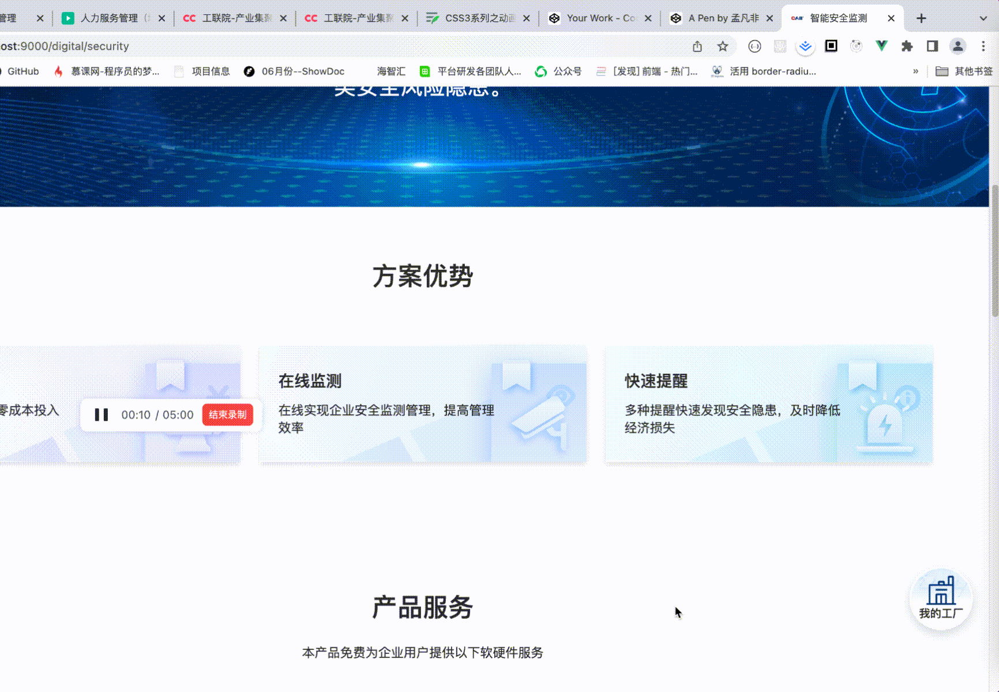

# CSS3系列之动画
## 什么是CSS3动画？
- 动画是使元素从一种样式逐渐变化为另一种样式的效果。
- 动画包括两个部分：描述动画的样式规则和用于指定动画开始、结束以及中间点样式的关键帧。
- 您可以改变任意多的样式任意多的次数。
- 请用百分比来规定变化发生的时间，或用关键词 "from" 和 "to"，等同于 0% 和 100%。
- 0% 是动画的开始，100% 是动画的完成。
- 为了得到最佳的浏览器支持，您应该始终定义 0% 和 100% 选择器。

## 动画和过渡有什么不同？
1. 过渡是两个状态的变化,动画可以定位为多个状态之间的变化过程
2. 过渡 ***需要被触发*** 才可以开始执行,动画 ***不需要触发条件*** 就可以设置执行
3. 过渡只可以执行 ***一次*** ,动画可以定义执行 ***多数***

## 属性介绍
### animation-name
> 指定由`@keyframes`描述的关键帧名称。

可以设置为none，表示无关键帧。可以不改变其他标识符的顺序而使动画失效，或者使层叠的动画样式失效。

### animation-delay
> 设置延时，即从元素加载完成之后到动画序列开始执行的这段时间。

默认值：0s，代表动画在应用到元素上之后立即执行

还可以是负值，定义一个负值会让动画立即开始。但是动画会从它的动画序列中某位置开始。例如，如果设定值为 -1s，动画会从它的动画序列的第 1 秒位置处立即开始。

```css
animation-delay: 3s;
animation-delay: 4ms;
/**单位必须带，不带不起作用**/
```

### animation-duration
> 设置动画的一个周期的时长

默认值：0s，表示无动画

不能是负值

```css
animation-duration: 3s;
animation-duration: 30ms;
/** 单位s，ms，必须带 **/
```

### animation-direction
> 设置动画在每次运行完后是反向运行还是重新回到开始位置重复运行。

默认值：normal

```css
/** 每个循环内动画向前循环，换言之，每个动画循环结束，动画重置到起点重新开始，这是默认属性。**/
animation-direction: normal;
/** 反向运行动画，每周期结束动画由尾到头运行。**/
animation-direction: reverse;
/** 动画交替反向运行，反向运行时，动画按步后退，同时，带时间功能的函数也反向，
比如，ease-in 在反向时成为 ease-out。计数取决于开始时是奇数迭代还是偶数迭代 **/
animation-direction: alternate;
/** 反向交替，反向开始交替。动画第一次运行时是反向的，然后下一次是正向，后面依次循环。**/
animation-direction: alternate-reverse;
```

### animation-iteration-count
> 设置动画重复次数，可以指定 infinite 无限次重复动画
```css
/* 值为关键字 */
animation-iteration-count: infinite;

/* 值为数字 */
animation-iteration-count: 3;
animation-iteration-count: 2.4;
```
`infinite`
无限循环播放动画。

`<number>`
动画播放的次数；默认值为1。可以用小数定义循环，来播放动画周期的一部分：例如，0.5 将播放到动画周期的一半。

不可为负值。

### animation-play-state
> 允许暂停和恢复动画。可以通过查询它来确定动画是否正在运行。另外，它的值可以被设置为暂停和恢复的动画的重放。

```css
animation-play-state: running; /** 运行 **/
animation-play-state: paused; /** 停止 **/
```

### animation-timing-function
> 设置动画速度，即通过建立加速度曲线，设置动画在关键帧之间是如何变化。
>
> 定义 CSS 动画在每一动画周期中执行的节奏。可能值为一或多个 `<timing-function>`。
>
> 对于关键帧动画来说，timing function 作用于一个关键帧周期而非整个动画周期，即从关键帧开始开始，到关键帧结束结束。
>
> 定义于一个关键帧区块的缓动函数 (animation timing function) 应用到该关键帧；另外，若该关键帧没有定义缓动函数，则使用定义于整个动画的缓动函数。

```css
/* Keyword values */
animation-timing-function: ease;
animation-timing-function: ease-in;
animation-timing-function: ease-out;
animation-timing-function: ease-in-out;
animation-timing-function: linear;
animation-timing-function: step-start;
animation-timing-function: step-end;

/* Function values */
animation-timing-function: cubic-bezier(0.1, 0.7, 1.0, 0.1);
animation-timing-function: steps(4, end);
animation-timing-function: frames(10);

/* Multiple animations */
animation-timing-function: ease, step-start, cubic-bezier(0.1, 0.7, 1.0, 0.1);
```

### animation-fill-mode
> 指定动画执行前后如何为目标元素应用样式。
```css
/** 当动画未执行时，动画将不会将任何样式应用于目标，
而是已经赋予给该元素的 CSS 规则来显示该元素。这是默认值。**/
animation-fill-mode: none;
/** 目标将保留由执行期间遇到的最后一个关键帧计算值。
最后一个关键帧取决于animation-direction和animation-iteration-count的值 **/
animation-fill-mode: forwards;
/** 动画将在应用于目标时立即应用第一个关键帧中定义的值，并在animation-delay期间保留此值。
第一个关键帧取决于animation-direction的值 **/
animation-fill-mode: backwards;
/** 动画将遵循forwards和backwards的规则，从而在两个方向上扩展动画属性。**/
animation-fill-mode: both;
``` 
### animation
> animation 属性是 animation-name，animation-duration, animation-timing-function，animation-delay，animation-iteration-count，animation-direction，animation-fill-mode 和 animation-play-state 属性的一个简写属性形式

```css
/* @keyframes duration | easing-function | delay |
iteration-count | direction | fill-mode | play-state | name */
animation: 3s ease-in 1s 2 reverse both paused slidein;

/* @keyframes duration | easing-function | delay | name */
animation: 3s linear 1s slidein;
```

::: warning
每个动画定义中的属性值的顺序很重要：可以被解析为 `<time>` 的第一个值被分配给`animation-duration`，第二个分配给 `animation-delay`。
:::

### @keyframes定义动画关键帧
```css
@keyframes slidein {
  0% {
    margin-left: 100%;
    width: 300%;
  }

  100% {
    margin-left: 0%;
    width: 100%;
  }
}
```

## 实例
### 1. 鼠标悬浮按钮之上，然后弹出三个按钮选项


```vue
<template>
  <div>
    <div class="myFactory" :class="animateClass" @mouseleave="show = false">
      <div class="baseCircle space1" :class="bounceInAnimate">
        <span>智能安全</span>
      </div>
      <div class="baseCircle space2" :class="bounceInAnimate">
        <span>智慧能源</span>
      </div>
      <div class="baseCircle space3" :class="bounceInAnimate">
        <span>智慧设备</span>
      </div>
    </div>
    <div class="factory" @mouseenter="handleMouseEnter">
      <span>我的工厂</span>
    </div>
  </div>
</template>

<script>
  export default {
    name: 'MyFactory',
    data () {
      return {
        show: false
      }
    },
    computed: {
      animateClass () {
        return this.show ? 'animated' : ''
      },
      bounceInAnimate () {
        return this.show ? 'bounceInAnimate' : ''
      }
    },
    methods: {
      handleMouseEnter () {
        this.show = true
      }
    }
  }
</script>

<style scoped lang="less">
  .myFactory {
    position: fixed;
    right: 0;
    bottom: 20px;
    z-index: 98;
    width: 160px;
    height: 200px;
    background-image: url(~@/assets/imgs/digital/factoryBg.png);
    background-size: 100% 100%;
    display: none;
    .baseCircle {
      width: 56px;
      height: 56px;
      background: #eff7ff;
      border: 2px solid #ffffff;
      border-radius: 50%;
      box-shadow: 0 4px 10px 0 rgba(0,22,49,0.10), 0 6px 12px 0 rgba(239,247,255,0.94) inset;
      display: flex;
      justify-content: center;
      align-items: center;
      cursor: pointer;
      opacity: 0;
      span {
        width: 28px;
        height: 34px;
        font-size: 14px;
        font-weight: 500;
        text-align: center;
        color: #333333;
        line-height: 17px;
      }
      &:hover {
        span {
          color: @primary-color;
        }
      }
    }
    .space1 {
      position: absolute;
      top: -4px;
      left: 44px;
      animation-delay: 0.3s;
    }
    .space2 {
      position: absolute;
      top: 72px;
      left: -12px;
      animation-delay: 0.4s;
    }
    .space3 {
      position: absolute;
      bottom: -4px;
      left: 44px;
      animation-delay: 0.5s;
    }
  }
  .factory {
    @apply w-20;
    @apply h-20;
    border-radius: 50%;
    box-shadow: 0 5px 14px 0 rgba(0,22,49,0.15);
    background-image: url(~@/assets/imgs/digital/factory.png);
    background-size: 100% 100%;
    @apply fixed;
    @apply right-5;
    @apply bottom-20;
    z-index: 99;
    font-size: 14px;
    font-weight: 500;
    text-align: center;
    color: #333333;
    line-height: 20px;
    padding-top: 49px;
    cursor: pointer;
  }
  .animated {
    display: block;
    animation: rotateIn 0.3s;
  }
  @keyframes rotateIn {
    0% {
      transform-origin: 100px 100px;
      transform: rotateZ(180deg);
      opacity: 0;
    }
    100% {
      transform-origin: 100px 100px;
      transform: none;
      opacity: 1;
    }
  }
  .bounceInAnimate {
    animation: bounceIn 0.3s forwards;
  }
  @keyframes bounceIn {
    0%, 100%, 20%, 40%, 60%, 80% {
      transition-timing-function: cubic-bezier(0.215, .61, .355, 1)
    }
    0% {
      opacity: 0;
      transform: scale3d(.3, .3, .3)
    }
    20% {
      transform: scale3d(1.1, 1.1, 1.1)
    }
    40% {
      transform: scale3d(.9, .9, .9)
    }
    60% {
    opacity: 1;
    transform: scale3d(1.03, 1.03, 1.03)
    }
    80% {
    transform: scale3d(.97, .97, .97)
    }
    100% {
    opacity: 1;
    transform: scale3d(1, 1, 1)
    }
  }
</style>
```

### 2. 循环自动滚动行，品牌商标滚动
<iframe src="https://codepen.io/mengfanfei/embed/VwGarLq" width="100%" height="500"></iframe>

### 3. 文字打印机效果，js实现


```vue
<template>
  <div class="legal percentage-container flex">
    <div v-for="(item, index) in list" :key="index" class="card" :class="{'activeCard': currentIndex === index}" @mouseenter="handleMouseEnter(index)">
      
      <div class="cardAfter">
        <div class="mb-3 text-f24 font-medium leading-33 line-clamp-1 title">{{ item.title }}</div>
        <div class="text-f16 font-normal leading-22 line-clamp-2 text-justify">{{ item.subTitle }}</div>
      </div>
    </div>
  </div>
</template>

<script>
export default {
  name: 'Legal',
  data () {
    return {
      currentIndex: 0,
      list: [
        { title: '业务指南', subTitle: '提供督促惠企政策落实等法律服务，帮助企业提高法务工作效率，助力企业法律风险防范、稳健经营', subTitleCopy: '提供督促惠企政策落实等法律服务，帮助企业提高法务工作效率，助力企业法律风险防范、稳健经营', imgUrl: require('@/assets/imgs/gov/companyService/img10.png') },
        { title: '服务案例', subTitle: '丰富的案件场景，专业的律师团队，通过典型案例，明确参照，类案同判', subTitleCopy: '丰富的案件场景，专业的律师团队，通过典型案例，明确参照，类案同判', imgUrl: require('@/assets/imgs/gov/companyService/img11.png') },
        { title: '服务资源', subTitle: '集合优秀律师、公证员、调解员等服务团体，汇聚专业服务平台资源，享受方便快捷的线上法律咨询', subTitleCopy: '集合优秀律师、公证员、调解员等服务团体，汇聚专业服务平台资源，享受方便快捷的线上法律咨询', imgUrl: require('@/assets/imgs/gov/companyService/img12.png') }
      ],
      timer: null
    }
  },
  methods: {
    handleMouseEnter (index) {
      if (this.currentIndex === index && this.timer) {
        return
      }
      if (this.currentIndex !== index) {
        this.list[this.currentIndex].subTitle = this.list[this.currentIndex].subTitleCopy
        clearInterval(this.timer)
        this.timer = null
      }
      this.currentIndex = index
      // 字符串转成数组
      const strArr = this.list[index].subTitle.split('')
      // 先把字符串设置成空
      this.list[index].subTitle = ''
      // 设置定时器，原理：
      // 1. 拿到需要打字机效果的字符串，转成数组存起来
      // 2. 使用shift函数将数组第一个值拿出来，并将数组第一个删除
      // 3. 先重置显示的字符串为空，然后间隔一定的时间（10ms）将2中拿出来的值添加到需要显示的字符串中
      // 4. 当1中的数组length===0了，清楚定时器
      this.timer = setInterval(() => {
        if (strArr.length === 0) {
          clearInterval(this.timer)
          this.timer = null
        } else {
          const word = strArr.shift()
          this.list[index].subTitle = this.list[index].subTitle.concat(word)
        }
      }, 10)
    }
  }
}
</script>

<style scoped lang="less">
.legal {
  height: 340px;
  display: flex;
  .card {
    cursor: pointer;
    flex: 1;
    position: relative;
    transition: flex-grow 0.3s;
    &::before {
      content: "";
      position: absolute;
      top: 0;
      left: 0;
      width: 100%;
      height: 100%;
      opacity: 0.7;
      z-index: 1;
    }
    &:nth-of-type(1) {
      &::before {
        background: linear-gradient(180deg,rgba(21,100,192,0.00) 38%, rgba(21,100,192,0.16) 47%, rgba(21,100,192,0.84) 88%);
      }
    }
    &:nth-of-type(2) {
      &::before {
        background: linear-gradient(180deg,rgba(29,128,146,0.00) 37%, rgba(29,128,146,0.16) 40%, rgba(29,128,146,0.84) 90%);
      }
    }
    &:nth-of-type(3) {
      &::before {
        background: linear-gradient(180deg,rgba(68,85,213,0.00) 37%, rgba(68,85,213,0.16) 46%, rgba(68,85,213,0.84) 91%);
      }
    }
    .cardAfter {
      padding: 24px;
      position: absolute;
      bottom: 0;
      left: 0;
      width: 100%;
      height: 137px;
      background: rgba(255,255,255,0.16);
      box-shadow: 0px -4px 20px 0px rgba(2,30,64,0.13);
      backdrop-filter: blur(10px);
      z-index: 2;
      color: #fff;
    }
  }
  .activeCard {
    flex-grow: 2 !important;
  }
}
</style>
```