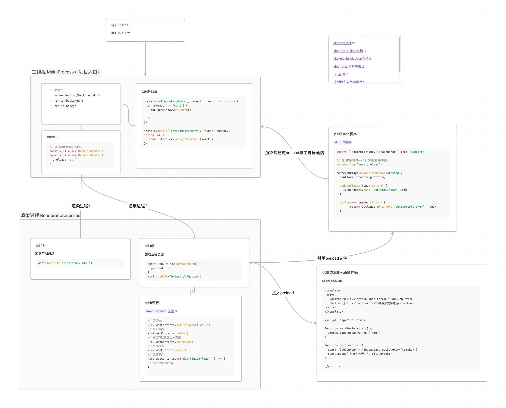

# electron 进程与通信



## 主进程
> 每个 Electron 应用都有一个单一的主进程，作为应用程序的入口点。 
> 主进程在 Node.js 环境中运行，这意味着它具有 require 模块和使用所有 Node.js API 的能力。

### 窗口管理
> 主进程的主要目的是使用 BrowserWindow 模块创建和管理应用程序窗口。

> `BrowserWindow` 类的每个实例创建一个应用程序窗口，且在单独的渲染器进程中加载一个网页。 您可从主进程用 window 的 `webContent` 对象与网页内容进行交互。

> 由于 `BrowserWindow` 模块是一个 `EventEmitter`， 所以您也可以为各种用户事件 ( 例如，最小化 或 最大化您的窗口 ) 添加处理程序。

> 当一个 `BrowserWindow` 实例被销毁时，与其相应的渲染器进程也会被终止。

### 应用程序生命周期

> 主进程还能通过 Electron 的 app 模块来控制您应用程序的生命周期。 该模块提供了一整套的事件和方法，可以让您用来添加自定义的应用程序行为 (例如：以编程方式退出您的应用程序、修改应用程序坞，或显示一个关于面板) 。

### 原生API
> 为了使 Electron 的功能不仅仅限于对网页内容的封装，主进程也添加了自定义的 API 来与用户的作业系统进行交互。 Electron 有着多种控制原生桌面功能的模块，例如菜单、对话框以及托盘图标。

实际举例代码

```ts
import { app, BrowserWindow, globalShortcut, ipcMain, Tray, nativeImage, session, BrowserView } from 'electron'
import { setApplicationMenu, getTrayContextMenu } from './services/menu'
import { getDisplaySize, isMacOS } from './utils'
import { siteConfig } from './config'
import { sendNotification } from './services/notifaction'
import path from 'path'
import Store from 'electron-store'
import updater from './services/update'

Store.initRenderer()
let isBrowserViewReady = false
let mainView: BrowserView | null = null
let mainWin: BrowserWindow | null = null
const isMac = isMacOS()

// const isDevelopment = process.env.NODE_ENV === 'development'
console.log('当前环境', process.env.NODE_ENV)
console.log('加载地址', process.env.VITE_APP_MAIN_LOAD_URL)

// opt win32 notification show 'electron.app.xxxx'
if (process.platform === 'win32') {
  app.setAppUserModelId(process.env.VITE_APP_NAME!)
}

// opt macos
app.on('activate', () => {
  if (BrowserWindow.getAllWindows().length === 0) createWindowWithView()
})


app.on('ready', async () => {
  // 处理进程间通信相关内容
  initIpcMainListeners()
  await createWindowWithView()

  // 设置菜单
  setApplicationMenu()
  // 注册开发工具快捷键
  regDevToolsShortcut(mainWin!, 'CommandOrControl+Shift+o')
  regDevToolsShortcut(mainView!, 'CommandOrControl+Shift+i')
  // 注册系统托盘
  regTray()

  // 注册更新程序
  updater(mainWin!, true)

  // 主窗口监听资源准备完成
  mainWin!.once('ready-to-show', () => {
    mainView!.webContents.setZoomFactor(1)
  })

  mainWin?.on('resize', () => {
    let isMaximized = mainWin?.isMaximized()
    let isFullScreen = mainWin?.isFullScreen() // 是否全屏，暂时用不到
    mainWin?.webContents.send('window-resize', { isMaximized, isFullScreen })
  })

  mainWin!.on('closed', () => {
    mainWin = null
  })

  mainView!.webContents.on('dom-ready', () => {
    isBrowserViewReady = true
    mainWin?.webContents.send('set-view-ready')
  })

  mainView!.webContents.on('did-navigate', () => checkViewNavUpdate())
  mainView!.webContents.on('did-navigate-in-page', () => checkViewNavUpdate())
})

app.on('window-all-closed', () => {
  if (process.platform !== 'darwin') {
    app.quit()
  }
})

function initIpcMainListeners () {
  // window更新相关操作
  ipcMain.on('update:window', (_, cmd: string) => {
    const focusedWindow = BrowserWindow.getFocusedWindow()
    if (!focusedWindow) return

    switch (cmd) {
      case 'minimize': {
        focusedWindow.minimize()
        break
      }
      case 'maximize': {
        if (focusedWindow.isMaximized()) {
          focusedWindow.unmaximize()
        } else {
          focusedWindow.maximize()
        }
        break
      }
      case 'close': {
        focusedWindow.close()
        break
      }
    }
  })
  // 通知
  ipcMain.on('notification', (_, arg) => sendNotification(arg))
  // 设置token
  ipcMain.handle('setToken', (_, value: string, url: string) => {
    const name = process.env.VITE_APP_SSO_COOKIE_KEY!
    if (!value) return session.defaultSession.cookies.remove(url, name)

    session.defaultSession.cookies.set({ name, value, url })
  })

  ipcMain.on('dispatch-navigator', (_, cmd: string) => {
    const view = mainView!

    switch (cmd) {
      case 'reload': {
        view.webContents.reload()
        break
      }
      case 'back': {
        if (view.webContents.canGoBack()) {
          view.webContents.goBack()
        }
        break
      }
      case 'forward': {
        if (view.webContents.canGoForward()) {
          view.webContents.goForward()
        }
        break
      }
    }
  })

  ipcMain.on('refresh-navigator-status', () => {
    checkViewNavUpdate()
  })

  ipcMain.on('quit-app', () => {
    app.quit()
  })

  // 目前仅处理单窗口
  ipcMain.handle('check-view-dom-ready', () => isBrowserViewReady)
}

async function createWindowWithView () {
  const TITLEBAR_HEIGHT = 40
  const win = new BrowserWindow({
    ...getDisplaySize(),
    show: true,
    // frame: false, // "false" hide three control in macos
    titleBarStyle: isMac ? 'hiddenInset' : 'hidden', // show three control in macos
    webPreferences: {
      zoomFactor: 1,
      contextIsolation: false,
      nodeIntegration: true,
      // preload: path.join(__dirname, '../dist-electron/preload.js')
    }
  })
  const view = new BrowserView({ 
    webPreferences: { 
      zoomFactor: 1,
      contextIsolation: true,
      nodeIntegration: true,
      preload: path.join(__dirname, '../dist-electron/preload.js')
    } 
  })

  // view.webContents.openDevTools()
  // win.webContents.openDevTools()

  win.setBrowserView(view)
  if (app.isPackaged) {
    await win.loadFile('dist/index.html')
  } else {
    await win.loadURL('http://localhost:14001')
  }

  const contentBounds = win.getContentBounds()
  view.setBounds({ x: 0, y: TITLEBAR_HEIGHT, width: contentBounds.width, height: contentBounds.height - TITLEBAR_HEIGHT })
  view.setAutoResize({ width: true, height: true })

  view.webContents.loadURL(siteConfig.mainLoadUrl)

  mainView = view
  mainWin = win
}

function regDevToolsShortcut (win: BrowserWindow | BrowserView, accelerator: string) {
  globalShortcut.register(accelerator, () => {
    win.webContents.openDevTools()
  })
}

function regTray () {
  const iconPath = nativeImage.createFromPath(
    path.join(__dirname, '../public/icon-large.ico')
  )
  const tray = new Tray(iconPath)

  tray.setToolTip(siteConfig.appName)
  tray.setContextMenu(getTrayContextMenu())
}

function checkViewNavUpdate () {
  const view = mainView
  const win = mainWin
  if (!view || !win) return

  const canGoBack = view.webContents.canGoBack()
  const canGoForward = view.webContents.canGoForward()

  win?.webContents.send('update-navigator-status', {
    canGoBack,
    canGoForward
  })
}
```

## 渲染器进程
> 每个 Electron 应用都会为每个打开的 BrowserWindow ( 与每个网页嵌入 ) 生成一个单独的渲染器进程。 洽如其名，渲染器负责 渲染 网页内容。 所以实际上，运行于渲染器进程中的代码是须遵照网页标准的 (至少就目前使用的 Chromium 而言是如此) 。
>
> 因此，一个浏览器窗口中的所有的用户界面和应用功能，都应与您在网页开发上使用相同的工具和规范来进行攥写。
> 这也意味着渲染器无权直接访问 require 或其他 Node.js API。

## Preload 脚本
> 预加载（preload）脚本包含了那些执行于渲染器进程中，且先于网页内容开始加载的代码 。 
> 这些脚本虽运行于渲染器的环境中，却因能访问 Node.js API 而拥有了更多的权限。
> 预加载脚本可以在 BrowserWindow 构造方法中的 webPreferences 选项里被附加到主进程。
> 因为预加载脚本与浏览器共享同一个全局 Window 接口，并且可以访问 Node.js API，所以它通过在全局 window 中暴露任意 API 来增强渲染器，以便你的网页内容使用。
> 虽然预加载脚本与其所附着的渲染器在共享着一个全局 window 对象，但您并不能从中直接附加任何变动到 window 之上，因为 `contextIsolation` 是默认的。
> 语境隔离（Context Isolation）意味着预加载脚本与渲染器的主要运行环境是隔离开来的，以避免泄漏任何具特权的 API 到您的网页内容代码中。
> 取而代之，我们將使用 `contextBridge` 模块来安全地实现交互
>
> 此功能对两个主要目的來說非常有用：
>
> - 通过暴露 ipcRenderer 帮手模块于渲染器中，您可以使用 进程间通讯 ( inter-process communication, IPC ) 来从渲染器触发主进程任务 ( 反之亦然 ) 。
> - 如果您正在为远程 URL 上托管的现有 web 应用开发 Electron 封裝，则您可在渲染器的 window 全局变量上添加自定义的属性，好在 web 客户端用上仅适用于桌面应用的设计逻辑。

实际案例代码

```ts
import { contextBridge, ipcRenderer } from 'electron'
import store, { getWebContentTokenByStore } from './services/storage'
import * as utils from './utils'
import { info } from './services/info'

contextBridge.exposeInMainWorld('$app', {
  isMac: utils.isMacOS(),
  // 系统信息，版本信息等
  info,

  setStore (key: string, value: any) {
    store.set(key, value)
  },

  deleteStore (key: string) {
    key && store.delete(key)
  },

  getStore (key: string) {
    return store.get(key)
  },

  /**
   * 刷新导航栏状态
   */
  refreshNavStatus () {
    ipcRenderer.send('refresh-navigator-status')
  },

  /**
   * 检查更新
   */
  checkUpdate () {
    return ipcRenderer.invoke('check-update')
  },

  // 暂时屏蔽, upload主逻辑不在preload中维护
  // downloadUpdate () {
  //   ipcRenderer.send('download-update')
  // },
  // quitAndInstall () {
  //   ipcRenderer.send('do-update')
  // },
  // initUpdateDispatch (handle: any) {
  //   ipcRenderer.on('update-dispatch', (_, args) => handle(args))
  // }
  // end of 屏蔽
})

recoveryToken()

function recoveryToken () {
  const token = getWebContentTokenByStore()
  console.log('@recoveryToken', token)
  ipcRenderer.invoke('setToken', token, location.origin)
}
```

## 进程间通信
> 在 Electron 中，进程使用 ipcMain 和 ipcRenderer 模块，通过开发人员定义的“通道”传递消息来进行通信。 这些通道是 任意 （您可以随意命名它们）和 双向 （您可以在两个模块中使用相同的通道名称）的。

### 渲染器进程到主进程（单向）
> 要将单向 IPC 消息从渲染器进程发送到主进程，您可以使用 `ipcRenderer.send` API 发送消息，然后使用 `ipcMain.on` API 接收。
> 通常使用此模式从 Web 内容调用主进程 API。

```ts
// main.js
// window更新相关操作
  ipcMain.on('update:window', (_, cmd: string) => {
    const focusedWindow = BrowserWindow.getFocusedWindow()
    if (!focusedWindow) return

    switch (cmd) {
      case 'minimize': {
        focusedWindow.minimize()
        break
      }
      case 'maximize': {
        if (focusedWindow.isMaximized()) {
          focusedWindow.unmaximize()
        } else {
          focusedWindow.maximize()
        }
        break
      }
      case 'close': {
        focusedWindow.close()
        break
      }
    }
  })
```
```vue
<!-- 此举例将上下文隔离关闭，直接在网页中使用ipcRenderer.send，出于安全考虑，尽量少使用，可以通过preload.js讲方法挂在到window上 -->
<template>
  <div class="window-actions">
    <span @click="updateWindow('minimize')" class="action-item">
      <svg xmlns="http://www.w3.org/2000/svg" viewBox="0 0 1024 1024" data-v-ea893728=""><path fill="currentColor" d="M128 544h768a32 32 0 1 0 0-64H128a32 32 0 0 0 0 64"></path></svg>
    </span>

    <span @click="updateWindow('maximize')" class="action-item">
      <!-- 恢复icon -->
      <svg v-if="isMaximized" xmlns="http://www.w3.org/2000/svg" viewBox="0 0 1024 1024" data-v-ea893728=""><path fill="currentColor" d="M768 832a128 128 0 0 1-128 128H192A128 128 0 0 1 64 832V384a128 128 0 0 1 128-128v64a64 64 0 0 0-64 64v448a64 64 0 0 0 64 64h448a64 64 0 0 0 64-64z"></path><path fill="currentColor" d="M384 128a64 64 0 0 0-64 64v448a64 64 0 0 0 64 64h448a64 64 0 0 0 64-64V192a64 64 0 0 0-64-64zm0-64h448a128 128 0 0 1 128 128v448a128 128 0 0 1-128 128H384a128 128 0 0 1-128-128V192A128 128 0 0 1 384 64"></path></svg>
      <!-- 放大icon -->
      <svg v-else xmlns="http://www.w3.org/2000/svg" viewBox="0 0 1024 1024" data-v-ea893728=""><path fill="currentColor" d="m160 96.064 192 .192a32 32 0 0 1 0 64l-192-.192V352a32 32 0 0 1-64 0V96h64zm0 831.872V928H96V672a32 32 0 1 1 64 0v191.936l192-.192a32 32 0 1 1 0 64zM864 96.064V96h64v256a32 32 0 1 1-64 0V160.064l-192 .192a32 32 0 1 1 0-64l192-.192zm0 831.872-192-.192a32 32 0 0 1 0-64l192 .192V672a32 32 0 1 1 64 0v256h-64z"></path></svg>
    </span>

    <span @click="updateWindow('close')" class="action-item">
      <svg xmlns="http://www.w3.org/2000/svg" viewBox="0 0 1024 1024" data-v-ea893728=""><path fill="currentColor" d="M764.288 214.592 512 466.88 259.712 214.592a31.936 31.936 0 0 0-45.12 45.12L466.752 512 214.528 764.224a31.936 31.936 0 1 0 45.12 45.184L512 557.184l252.288 252.288a31.936 31.936 0 0 0 45.12-45.12L557.12 512.064l252.288-252.352a31.936 31.936 0 1 0-45.12-45.184z"></path></svg>
    </span>
  </div>
</template>
<script setup>
const { ipcRenderer } = require('electron')

function updateWindow (cmd: string) {
  ipcRenderer.send('update:window', cmd)
}
</script>
```

### 渲染器进程到主进程（双向）
> 双向 IPC 的一个常见应用是从渲染器进程代码调用主进程模块并等待结果。 这可以通过将 `ipcRenderer.invoke` 与 `ipcMain.handle` 搭配使用来完成。

```ts
// main.js
ipcMain.handle('check-update', () => {
  return autoUpdater.checkForUpdates()
})
```
```ts
// preload.js
contextBridge.exposeInMainWorld('$app', {
/**
   * 检查更新
   */
  checkUpdate () {
    return ipcRenderer.invoke('check-update')
  }
}
```

### 主进程到渲染器进程
> 将消息从主进程发送到渲染器进程时，需要指定是哪一个渲染器接收消息。 消息需要通过其 WebContents 实例发送到渲染器进程。 此 WebContents 实例包含一个 send 方法，其使用方式与 ipcRenderer.send 相同。