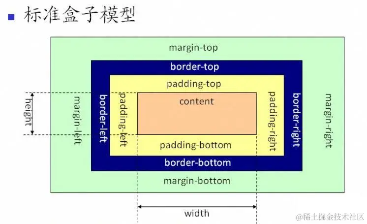
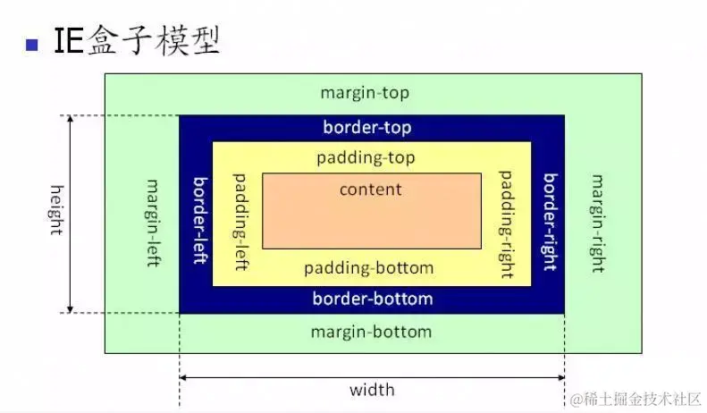

# CSS相关面试题

## 1. CSS盒子模型

::: info 介绍
css盒子模型包含了**元素内容（content）**、**内边距（padding）**、**边框（border）**、**外边距（margin）** 几个要素。
:::

### 标准盒子模型

元素框的总宽度 = width + padding-left + padding-right + border-left + border-right + margin-left + margin-right

元素框的总高度 = height + padding-top + padding-bottom + border-top + border-bottom + margin-top + margin-bottom

### IE盒子模型

元素框的总宽度 = width + margin-left + margin-right

元素框的总高度 = height + margin-top + margin-bottom

width = padding-left + padding-right + border-left + border-right + content

height = padding-top + padding-bottom + border-top + border-bottom + content

::: warning 注意
`box-sizing: border-box` 表示IE盒子模型

`box-sizing: content-box` 表示标准盒子模型
:::

## 2. css选择器以及优先级

### 选择器

- **通用选择器**  : `*`
- **元素选择器**  : `div` `p` `span`
- **类选择器**   : `class="text"  .text {}`
- **ID选择器** : `id="hello"  #hello {}`