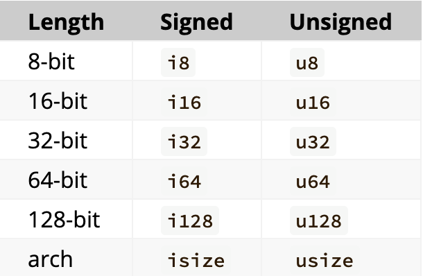
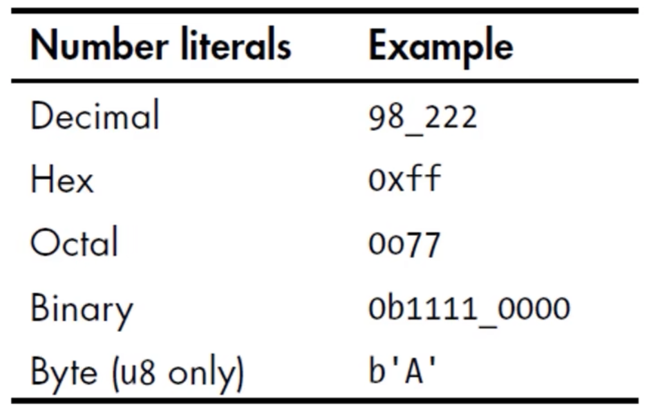

# 基础知识

## 1. 变量与可变性

- 声明变量使用`let`关键字
- 默认情况下，变量是不可变的(immutable)

```rust
fn main() {
  let x = 5;
  println!("The value of x is {}", x);

  x = 6; // error: cannot assign twice to immutable variable
  println!("The value of x is {}", x);
}

--------------------------------------

fn main() {
  let mut x = 5;
  println!("The value of x is {}", x);

  x = 6; // 正确
  println!("The value of x is {}", x);
}
```

- 声明变量时，在变量前面加上`mut`, 就可以使变量可变

## 2. 变量与常量

- 常量（constant），常量在绑定值以后也是不可变的，但是它与不可变的变量有很多区别：

    - 不可以使用`mut`, 常量永远都是不可变的
    - 声明常量使用`const`关键字，它的类型必须被标注
    - 常量可以在任何作用域内进行声明，包括全局作用域
    - 常量只可以绑定到常量表达式，无法绑定到函数的调用结果或只能在运行时才能计算出的值
- 在程序运行期间，常量在其声明的作用域内一直有效
- 命名规范：Rust里常量使用全大写字母，每个单词之间用下划线分开，例如：`MAX_POINTS`
- 例子： `const MAX_POINTS: u32 = 100_000;`(在数字的字面值里可以增加下划线，增加可读性)

## 3. Shadowing（隐藏）
- 可以使用相同的名字声明新的变量，新的变量就会shadow（隐藏）之前声明的同名变量
  - 在后续的代码中这个变量名代表的就是新的变量

```rust
fn main() {
  let x = 5;
  x = x + 1; // 错误
  println!("The value of x is {}", x);
}

----------------------

fn main() {
  let x = 5;
  let x = x + 1; // 正确，shadowing
  let x = x * 2;
  println!("The value of x is {}", x); // 12
}
```

- shadow 和把变量标记为`mut`是不一样的：
  - 如果不使用`let`关键字，那么重新给非 `mut`的变量赋值会导致编译时错误
  - 而使用`let`声明的同名新变量，也是不可变的
  - 使用`let`声明的同名新变量，它的类型可以与之前不同

  ```rust
  fn main() {
    let spaces = "     ";  // $str 类型
    let spaces = spaces.len();  // usize 类型
    println!("{}", spaces);
  }

  ----------

  fn main() {
    let mut spaces = "     ";  // &str l类型
    spaces = spaces.len();  // error: mismatched types -- expected `&str`, found `usize`
    println!("{}", spaces);
  }
  ```

## 4. 数据类型-标量类型

> **数据类型**
>  - **标量**和**复合**类型
>
>  - Rust是静态编译语言，在编译时必须知道所有变量的类型
>    - 基于使用的值，编译器通常能够推断出它的具体类型
>    - 但如果可能的类型比较多（例如把String转成整数的parse方法），就必须添加类型的标注，否则编译会报错
>
>    ```rust
>    fn main() {
>      let guess: u32 = "42".parse().expect("Not a number");
>      println!("{}", guess);
>    }
>    ```

- 一个标量类型代表一个单个的值
- Rust有四个主要的标量类型：
  1. 整数类型
  2. 浮点类型
  3. 布尔类型
  4. 字符类型

**整数类型**

- 整数类型没有小数部分
- 例如`u32`就是一个无符号的整数类型，占据32位的空间
- 无符号整数类型以 `u`开头
- 有符号整数类型以 `i`开头
- Rust的整数类型列表如图：
    
    - 每种都分`i`和`u`，以及固定的位数
    - 有符号范围：
     - -(2^n - 1)到2^n-1 - 1
    - 无符号范围：
     - 0 到 2^n - 1


**整数字面值**



- 除了 `byte`类型外，所有的数值字面值都允许使用类型后缀
  - 例如：57u8

- 如果你不清楚应该使用哪种类型，可以使用Rust相应的默认类型：
  - 整数的默认类型是 `i32`


::: warning 整数溢出
- 例如：u8的范围是0-255，如果你把一个u8变量的值设为256， 那么：
  - 调试模式下编译：Rust会检查整数溢出，如果发生溢出，程序在运行时就会panic
  - 发布模式下（--release）编译：Rust不会检查可能导致panic的整数溢出
    - 如果溢出发生：Rust会执行“环绕”操作：

      - 256变成0，257变成1 。。。

      - 但程序不会panic
:::


**浮点类型**

- Rust有两种基础的浮点类型，也就是含有小数部分的类型
  - f32，32位，单精度
  - f64，64位，双精度

- Rust的浮点类型使用了IEEE-754标准来表述
- `f64`是默认类型，因为在现代CPU上f64和f32的速度差不多，而且精度更高

```rust
fn main() {
  let x = 2.0; // f64
  let x: f32 = 3.0; // f32
}
```

**布尔类型**

- Rust的布尔类型也有两个值： `true`和`false`
- 一个字节大小
- 符号 `bool`

```rust
fn main() {
  let x = true; // bool
  let y: bool = false;
}
```

**字符类型**

- Rust语言中`char`类型被用来描述语言中最基础的单个字符
- 字符类型的字面值使用***单引号***
- 占用4字节大小
- 是Unicode标量值，可以表示比ASCII多的多的字符内容：拼音，中日韩文，零长度空白字符，emoji表情等
  - U+0000 到 U+D7FF
  - U+E000 到 U+10FFFF

- 但Unicode中并没有“字符”的概念，所以直觉上认为的字符也许与Rust中的概念并不相符

```rust
fn main() {
  let x = 'z';
  let y: char = '￠';
  let z = '😂';
}
```

## 5. 数据类型-复合类型

- 复合类型可以将多个值放在一个类型里
- Rust提供了两种基础的复合类型：元组（Tuple），数组

**元组（Tuple）**

- Tuple可以将多个类型的多个值放在一个类型中
- Tuple的长度是固定的：一旦声明就无法改变

**创建Tuple**
- 在小括号里，将值用逗号分开
- Tuple中的每个位置都对应一个类型，Tuple中的个元素的类型不必相同

```rust
fn main() {
  let tup: (i32, f64, u8) = (500, 6.3, 1);

  println!("{}, {}, {}", tup.0, tup.1, tup.2);
}
```

**获取Tuple的元素值**

- 可以使用模式匹配来解构（destructure）一个Tuple来获取元素值

```rust
fn main() {
  let tup: (i32, f64, u8) = (500, 6.3, 1);
  let (x, y, z) = tup;
  println!("{}, {}, {}", x, y, z);
}
```

**访问Tuple的元素**

- 在Tuple变量使用点标记法，后接元素的索引号


**数组**

- 数组也可以将多个值放在一个类型里
- 数组中的每个元素的类型必须相同
- 数组的长度也是固定的

**声明一个数组**

- 在中括号里，各值用逗号分开
  
  ```rust
  fn main() {
    let a = [1,2,3,4,5];
  }
  ```

**数组的用处**

- 如果想让你的数据存放在stack（栈）上而不是heap（堆）上，或者想保证有固定数量的元素，这时使用数组更有好处
- 数组没有`Vector`灵活
  - Vector和数组类似，它由标准库提供
  - Vector的长度可以改变
  - 如果你不确定应该用数组还是Vector，那么估计你应该用Vector


**数组的类型**

- 数组的类型以这种形式表示： [类型：长度]
  - 例如： `let a: [i32; 5] = [1,2,3,4,5];`

**另一种声明数组的方法**

- 如果数组的每个元素值都相同，那么可以在：
  - 在中括号里指定初始值
  - 然后是一个“;”
  - 最后是数组的长度

- 例如： `let a = [3; 5];` 它就相当于：`let a = [3,3,3,3,3];`

**访问数组的元素**

- 数组是 stack 上分配的单个块的内存
- 可以使用索引来访问数组的元素
- 如果访问的索引超出了数组的范围，那么：
  - 编译会通过（有时也不会通过）
  - 运行会报错（runtime时会panic）
    - Rust不会允许其继续访问相应地址的内存


## 6. 函数

- 声明函数使用`fn`关键字
- 依照惯例，针对函数和变量名，Rust使用 snake case命名规范：
  - 所有的字母都是小写的，单词之间使用下划线分开
  ```rust
  fn main() {
    println!("hello world");
    another_function()
  }
  fn another_function() {
    println!("Another function");
  }
  ```

**函数的参数**
- parameters， arguments
- 在函数的签名里，必须声明每个参数的类型
  ```rust
  fn main() {
    println!("hello world");
    another_function(5); // argument
  }
  fn another_function(x: i32) { // parameter
    println!("{}", x);
  }
  ```

**函数体中的语句与表达式**

- 函数体由一系列`语句`组成，可选的由一个`表达式`结束
- Rust是一个基于表达式的语言
- 语句是执行一些动作的指令
- 表达式会计算产生一个值
- 函数的定义也是语句
- 语句不返回值，所以不可以使用let讲一个语句赋给一个变量

```rust
fn main() {
  let x = 5;
  let y = {
    let x = 1;
    x + 3
  };

  println!("The value of y is: {}", y)
}
```

**函数的返回值**

- 在`->`符号后边声明函数返回值的类型，但是不可以为返回值命名
- 在Rust里面，返回值就是函数体里面最后一个表达式的值
- 若想提前返回，需使用return关键字，并指定一个值
  - 大多数函数都是默认使用最后一个表达式为返回值、

  ```rust
  fn five() -> i32 {
    5
  }

  fn main() {
    let x = five();

    println!("The value of x is: {}", x);
  }
  ```

  ## 7. 注释

  ```rust
  // this is a function
  fn five() -> i32 {
    5
  }

  /* 注释
  什么啊注释
   */

   // 多行注释啊
   // hello
  fn main() {
    // 注释
    let x = five(); // 注释

    println!("The value of x is: {}", x);
  }
  ```

## 8. 控制流：if-else

- if表达式允许您根据条件来执行不同的代码分支
- 这个条件必须是bool类型
- if表达式中，与条件相关联的代码块就是做分支（arm）
- 可选的，在后边可以加上一个else表达式

```rust
fn main() {
  let number = 3;
  if number < 5 {
    println!("condition was true");
  } else {
    println!("condition was false");
  }
}
```

**使用else if处理多重条件**

- 如果使用了多于一个else if，那么最好使用`match`来重构代码

**在`let`语句中使用`if`**
- 因为 `if` 是一个表达式，所以可以将它放在 `let` 语句中等号的右边

  ```rust
  fn main() {
    let condition = true;
    let number = if condition { 5 } else { 6 };

    println!("The value of number is: {}", numner);
  }
  ```

## 9. 控制流：循环

- Rust 提供了3中循环： `loop`, `while`, `for`

**loop循环**

- loop关键字告诉Rust反复的执行一块代码，直到你喊停
- 可以在loop循环中使用break关键字来告诉程序何时停止循环

```rust
fn main() {
  let mut counter = 0;
  let result = loop {
    counter += 1;

    if counter == 10 {
      break counter * 2;
    }
  };

  println!("The result is: {}", result);
}
```

**while 条件循环**

- 另外一种常见的循环模式是每次执行循环体之前都判断一次条件（while循环）

```rust
fn main() {
  let mut number = 3;
  while number != 0 {
    println!("{}!", number);

    number = number - 1;
  }

  println!("LIFTOFF!!!");
}
```

**使用for循环遍历集合**

- 可以使用while或loop来遍历集合，但是易错且低效
- 使用for循环更简洁紧凑，它可以针对集合中的每个元素来执行一些代码

```rust
fn main() {
  let a = [10,20,30,40,50];
  for element in a.iter() {
    println!("the value is: {}", element);
  }
}
```
- 由于for循环的安全、简洁性，所以它在Rust里用的最多


**Range**

- 标准库提供
- 指定一个开始数字和一个结束数字，Range可以生成它们之间的数字（不含结束）
- rev方法可以反转Range

```rust
fn main() {
  for number in (1..4).rev() {
    println!("{}!", number);
  }
  println!("LIFTOFF");
}
```