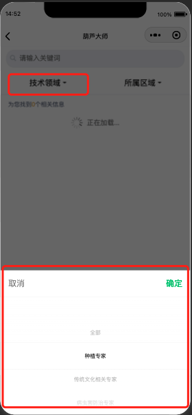

# uniapp 普通选择器

## 效果



选中值可以显示在上方

## 代码实现

```vue
<template>
  <view class="hl-option-picker">
    <picker 
      :range="options" 
      :value="selectedIndex" 
      @change="handlePicker"
      range-key="label" 
    >
      <view class="hl-option-picker-inner" :class="{'is-selected': isSelected}">
        <text class="display-label">{{ displayLabel }}</text>
        <image :src="isSelected ? ICON_DOWN_ACTIVE : ICON_DOWN" mode="scaleToFill" class="common-arrow-down" />
      </view>
    </picker>
  </view>
</template>

<script setup lang="ts">
import { computed } from 'vue'
import ICON_DOWN from '@/static/images/common/icon_down.png'
import ICON_DOWN_ACTIVE from '@/static/images/common/icon_down-active.png'

type option = { label: string, value: any }

const props = defineProps<{
  options: option[],
  modelValue: string | number,
  name: string // 搜索条件名称
}>()

const emits = defineEmits(['update:model-value', 'change'])
const selectedIndex = computed(() => {
  const index = props.options.findIndex(i => String(i.value) === String(props.modelValue))
  return index < 0 ? 0 : index
})
const selctedOption = computed(() => props.options[selectedIndex.value])
const isSelected = computed(() => selctedOption.value?.value) // ui特殊需求
const displayLabel = computed(() => {
  // 为选择选项，或选择了value为"”的选项（如“全部”条件）
  if (!props.modelValue) return props.name
  // 返回option.label || 搜索条件名称
  return selctedOption.value?.label || props.name
})

function handlePicker (e: any) {
  const index = e.detail.value
  const selectedOption = props.options[index]
  if (!selectedOption) return

  emits('update:model-value', selectedOption.value)
  emits('change')
}
</script>

<style lang="scss">
.hl-option-picker-inner {
  display: flex;
  justify-content: center;
  align-items: center;
  height: 96rpx;

  &.is-selected {
    .display-label {
      color: #D6A441;
    }
  }

  .common-arrow-down{
    width: 16rpx;
    height: 8rpx;
    display: block;
    margin-left: 8rpx;
  }
}
</style>
```

## 使用

```vue
<template>
  <view class="selector" :style="{gridTemplateColumns: 'repeat(2, 1fr)'}">
    <OptionPicker name="技术领域" v-model="queryParams.technologyDomainCode" :options="TechnicalFieldOptions" @change="searchHandler" />
    <OptionPicker name="所属区域" v-model="queryParams.innerOutStatus" :options="areaOptions" @change="searchHandler" />
  </view>
</template>
```