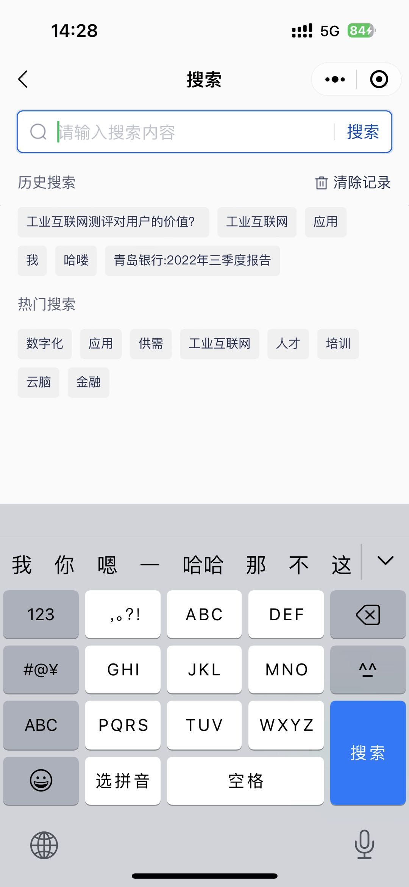

# 搜索+搜索历史+热门搜索

::: info

通过`搜索`+`搜索历史`+`热门搜索`+`搜索联想`，实现一个搜索框，用户可以输入关键字进行搜索，搜索结果会根据关键字进行匹配。

:::



## 1. 搜索框

搜索框是整个搜索功能的核心，用户可以在搜索框中输入关键字，点击搜索按钮或按下回车键后，触发搜索事件。

在搜索框的实现中还包括了对获取焦点和失去焦点的样式处理，对键盘的监听，占位文字的显示等。

## 2. 搜索历史

搜索历史用于记录用户的搜索历史，用户可以在搜索历史中选择关键字进行搜索。

通过将搜索历史存放在本地storage中，并将内容进行去重去空等处理。并监听是否获取了焦点进行回显。

## 3. 热门搜索

热门搜索用于展示热门搜索关键字，用户可以在热门搜索中选择关键字进行搜索。

## 4. 搜索联想

通过关键字的匹配，展示与关键字相关的搜索建议，用户可以在搜索建议中选择关键字进行搜索。

通过`debounce`来减少搜索请求的调用，提高用户体验。

输入框中有内容时将会出现搜索建议，当输入框中没有内容时，搜索建议将会隐藏，显示搜索历史和热门搜索。


## 5. 组件代码
搜索组件的代码实现如下：

```vue
<template>
  <view class="search_container" :class="{'search_container_active': is_focus}" @click.stop="moveHandle" @touchmove.stop.prevent="moveHandle">
    <view class="input_container" @click.stop="onFocus">
      <input
        type="text"
        :value="value"
        confirm-type="search"
        placeholder-style="color: rgba(0,14,48,0.25);"
        :placeholder="placeholder"
        :focus="is_focus"
        class="search_input"
        @input="onInput"
        @keyboardheightchange="onKeyboardheightchange"
        @confirm="(e: any) => onSearch(e.detail.value)">
      <image src="@/subPackages/search/static/search.png" class="search_image"></image>
      <image v-if="value" src="@/subPackages/search/static/circle_close.png" class="close_image" @click="onClose"></image>
    </view>
    <view class="line"></view>
    <view class="search_text" @click.stop="onSearch(value)">搜索</view>

    <!-- 搜索历史，联想列表等 -->
    <view v-if="is_focus || isShowHotWords" class="fixedMask" :style="{height: viewHeight + 'px'}" @click.stop="moveHandle" @touchmove.stop.prevent="moveHandle">
      <!-- 历史搜索 -->
      <template v-if="!value">
        <view class="title">
          <text>历史搜索</text>
          <view class="flex align-center" @click="deleteHistory">
            <image src="@/subPackages/search/static/delete.png" style="height: 28rpx; width: 28rpx;"></image>
            <text class="delete_his">清除记录</text>
          </view>
        </view>
        <view class="label_container">
          <view class="label_item text-ellipsis-1" v-for="(item, index) in historyWordsList" :key="index" @click.stop="labelClick(item)">{{ item }}</view>
        </view>
      </template>
      <!-- 热门搜索 -->
      <template v-if="!value">
        <view class="title">
          <text>热门搜索</text>
        </view>
        <view class="label_container">
          <view class="label_item text-ellipsis-1" v-for="(item, index) in hotWordsList" :key="index" @click.stop="labelClick(item)">{{ item }}</view>
        </view>
      </template>
      <!-- 联想 -->
      <template v-if="value">
        <view class="list_container">
          <view class="list_item text-ellipsis-1" v-for="(item, index) in suggestsList" :key="index" @click.stop="labelClick(item)">
            <rich-text class="text-ellipsis-1" :nodes="item"></rich-text>
          </view>
        </view>
      </template>
    </view>
  </view>
</template>

<script setup lang="ts">
import { nextTick, ref } from 'vue' 
import { searchHot } from '../../api/index'
import { onMounted, watch } from 'vue'
import { debounce } from 'lodash-es'
import { searchSuggest } from '../../api/index'


const props = defineProps({
  placeholder: {
    type: String,
    default: '请输入搜索内容'
  },
  value: {
    type: String,
    default: ''
  }
})
const emits = defineEmits(['update:value', 'search', 'input'])

const viewHeight = uni.getSystemInfoSync().windowHeight - uni.upx2px(96)

const is_focus = ref(true)

const isShowHotWords = ref(true)

const historyWordsList = ref([])

watch(is_focus, (newVal) => {
  if (newVal) {
    historyWordsList.value = uni.getStorageSync('globalSearchHistory').slice(0, 10) || []
  }
})

const onKeyboardheightchange = (e: any) => {
  if (e.detail.height === 0) {
    is_focus.value = false
  } else {
    is_focus.value = true
  }
}

const deleteHistory = () => {
  uni.removeStorageSync('globalSearchHistory')
  historyWordsList.value = []
  is_focus.value = false
  isShowHotWords.value = true
}

const suggestsList = ref([])

const getSuggestsList = debounce((value: string) => {
  searchSuggest(value).then((res: any) => {
    suggestsList.value = res.data
  })
}, 300)

const onInput = (e: any) => {
  emits('update:value', e.detail.value)
  emits('input', e.detail.value)
  getSuggestsList(e.detail.value)
}

const onBlur = () => {
  is_focus.value = false
}
const onFocus = () => {
  is_focus.value = false
  nextTick(() => {
    is_focus.value = true
  })
}

const onClose = () => {
  emits('update:value', '')
  emits('input', '')
}

const onSearch = (value: string) => {
  emits('search', value)
  is_focus.value = false
  isShowHotWords.value = false
  const data = new Set([value,  ...Array.from(uni.getStorageSync('globalSearchHistory'))])
  uni.setStorageSync('globalSearchHistory',  [...data].filter(i => i))
}

const hotWordsList = ref([])
const getHotWordsList = () => {
  // 获取热门搜索列表
  searchHot().then((res: any) => {
    hotWordsList.value = res.data
  })
}
onMounted(() => {
  getHotWordsList()
  historyWordsList.value = uni.getStorageSync('globalSearchHistory').slice(0, 10) || []
})

/**
 * 搜索建议,历史搜索，热门搜索点击
 */
const labelClick = (item: string) => {
  // 去掉标签
  const reg = /(<\/?font.*?>)|(<\/?span.*?>)|(<\/?a.*?>)/gi
  const keyword = item.replace(reg, '')
  emits('update:value', keyword)
  emits('input', keyword)
  onSearch(keyword)
  getSuggestsList(keyword)
}

const moveHandle = () => {
  isShowHotWords.value = true
  is_focus.value = false
  
  return
}
</script>

<style scoped lang="scss">
.search_container {
  box-sizing: border-box;
  height: 80rpx;
  background: #ffffff;
  border: 2rpx solid rgba(0,14,48,0.15);
  border-radius: 12rpx;
  display: flex;
  align-items: center;
  position: relative;
  .input_container {
    flex: 1;
    height: 100%;
    position: relative;
    .search_image {
      width: 36rpx;
      height: 36rpx;
      position: absolute;
      left: 22rpx;
      top: 50%;
      transform: translateY(-50%);
      // z-index: 1;
    }
    .search_input {
      height: 100%;
      flex: 1;
      font-size: 32rpx;
      text-align: left;
      color: $color-text-primaryText;
      line-height: 48rpx;
      caret-color: $color-text-primaryText;
      padding: 0 68rpx 0 74rpx;
    }
    .close_image {
      width: 36rpx;
      height: 36rpx;
      position: absolute;
      right: 24rpx;
      top: 50%;
      transform: translateY(-50%);
      // z-index: 1;
    }
  }
  
  .line {
    width: 2rpx;
    height: 32rpx;
    background: $color-dividers;
    flex-shrink: 0;
  }
  .search_text {
    box-sizing: border-box;
    height: 100%;
    display: flex;
    align-items: center;
    padding: 0 22rpx;
    font-size: 32rpx;
    color: $uni-primary;
    flex-shrink: 0;
    line-height: 48rpx;
  }

  .fixedMask {
    position: absolute;
    top: 80rpx;
    left: -32rpx;
    right: -32rpx;
    z-index: 20;
    background: $color-bg-default;
    padding: 0 32rpx;
    .title {
      font-size: 28rpx;
      color: $color-text-secondaryText;
      line-height: 44rpx;
      display: flex;
      justify-content: space-between;
      align-items: center;
      margin: 32rpx 0 8rpx 0;
      .delete_his {
        color: $color-text-primaryText;
        margin-left: 8rpx;
      }
    }
    .label_container {
      display: flex;
      flex-wrap: wrap;
      .label_item {
        height: 56rpx;
        line-height: 56rpx;
        background: #f0f0f2;
        border-radius: 8rpx;
        padding: 0 16rpx;
        max-width: 392rpx;
        margin: 16rpx 16rpx 0 0;
        font-size: 24rpx;
        color: $color-text-primaryText;
      }
    }

    .list_container {
      margin-top: 24rpx;
      .list_item {
        height: 80rpx;
        line-height: 80rpx;
        font-size: 28rpx;
        color: $color-text-primaryText;
      }
    }
  }
}
.search_container_active {
  border-color: $color-primary-hover;
  &::after {
    content: '';
    position: absolute;
    top: -4rpx;
    left: -4rpx;
    right: -4rpx;
    bottom: -4rpx;
    border: 4rpx solid rgba(0,93,221,0.15);
    border-radius: 12rpx;
    z-index: -1;
  }
}
</style>
```

## 6. 使用
使用时，只需在页面中引入该组件，并传入相应的参数即可。

并通过`v-model:value`绑定搜索关键字，并通过`@search`事件监听搜索操作。

这样就将所有的关于搜索的内容都封装在一起了，在需要搜索的地方，直接调用该组件即可。 在主页面上只需要处理搜索结果即可。

```vue
<template>
  <view>
    <!-- 搜索框 -->
    <view class="search_con" :style="{paddingBottom: isScroll && !isShowTabs ? '24rpx' : '0'}" @touchmove.stop.prevent="() => {}">
      <search-input v-model:value="queryParams.searchKey" @search="handleSearch"></search-input>
    </view>
  </view>
</template>

<script setup>
const handleSearch = async () => {
  // Tips.loading('搜索中')
  uni.pageScrollTo({ scrollTop: 0, duration: 0})
  setDefaultPagination()
  await getListData()
  // Tips.loaded()
}
</script>
```