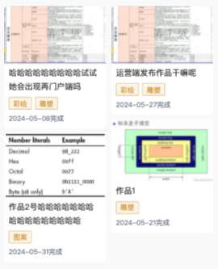

# uniapp瀑布流

## 引言

> 项目中要求实现一个两列的瀑布流模式，记录一下实现方式



## 思路

1. 首先实现一个自定义卡片组件，内容不限制，但是需要有`image`标签，因为要用到 `image`的`load`方法
2. 在`card`组件中，通过`image`的`load`方法，在方法中使用`uni.createSelectorQuery()`来获取当前`card`组件的高度等数据，然后通过`emit`将数据返回到父组件中
3. 通过`watch`监听列表数据的变化，然后根据逻辑：总的列表数据长度大于左右两边列表数据长度的话就取出下标值为左右两边列表数据长度的数据，然后将数据`push`到`leftHeight`,`rightHeight`比较小的那列中
4. 在`load`方法触发后，1.通过传入左右分栏的标识，将`card`的高度累加到`leftHeight`或`rightHeight`上，2.通过返回的数据中的id获取在总数据列表的索引值，
查找下一条数据，如果没有则`return`,3.如果存在值，则将值`push`进左右两侧高度较小的那一列中
5. 以此循环，当有数据时重复执行4，直到没有数据为止
6. 页面布局就是用`flex`两列布局，子项中还可以使用`grid`布局增加边距，适配web和微信小程序

## 代码实现

**card组件**

```vue
<template>
  <view class="card" @click="handleCardClick">
    <image class="card-image" :src="cardData.image" mode="widthFix" @load="handleImageLoad"></image>
    <view class="card-content">
      <slot></slot>
    </view>
  </view>
</template>

<script lang="ts" setup>
import { getCurrentInstance } from 'vue'

const props = defineProps({
  cardData: {
    type: Object,
    default: () => ({})
  }
})

const emit = defineEmits(['click', 'cardLoad'])

const handleCardClick = () => {
  emit('click', props.cardData)
}

const instance = getCurrentInstance()

const handleImageLoad = () => {
  const query = uni.createSelectorQuery().in(instance)
  query.select('.card').boundingClientRect(data => {
    emit('cardLoad', {...data, id: props.cardData.id})
  }).exec()
}
</script>
<style lang="scss" scoped>
.....
.card-image {
  ...
  height: auto; // 减轻因高度问题出现的图片闪烁
}
</style>
```

**父组件**

```vue
<template>
<view class="list-con">
  <view class="left-con">
    <opus-card v-for="item in leftList" :key="item.id" :opusData="item" @click="toDetail" @card-load="(data: any) => onCardLoad(data, 'left')"/>
  </view>
  <view class="right-con">
    <opus-card v-for="item in rightList" :key="item.id" :opusData="item" @click="toDetail" @card-load="(data: any) => onCardLoad(data, 'right')" />
  </view>
</view>
</template>

<script setup lang="scss">
const leftHeight = ref(0)
const rightHeight = ref(0)

const leftList = ref<any[]>([])
const rightList = ref<any[]>([])

watch(
  () => listData.value,
  () => {
    if (listData.value.length === 0) return
    if (listData.value.length > (leftList.value.length + rightList.value.length)) {
      const data = listData.value[leftList.value.length + rightList.value.length]
      if (leftHeight.value > rightHeight.value) {
        rightList.value.push(data)
      } else {
        leftList.value.push(data)
      }
    }
  },
  {
    immediate: true
  }
)

const onCardLoad = (data: any, LR: string) => {
  if (LR === 'left') {
    leftHeight.value += data.height
  } else if (LR === 'right') {
    rightHeight.value += data.height
  }

  const index = listData.value.findIndex((item: any) => item.id === data.id)

  const d = listData.value[index + 1]

  if (!d) return
  
  
  if (leftHeight.value > rightHeight.value) {
    rightList.value.push(d)
  } else {
    leftList.value.push(d)
  }
}


// 注意，如果有从头筛选时，需要将 leftHeight,leftList,rightHeight,rightList 置为0 初始化

</script>
```
