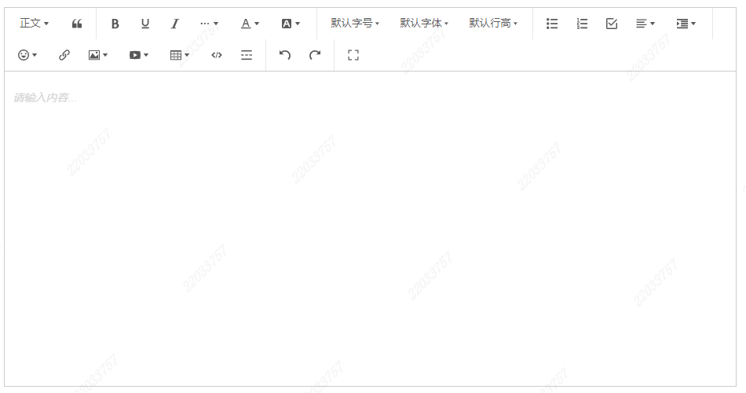

# Editor富文本编辑器

## 效果


## 安装
```shell
yarn add @wangeditor/editor^5.1.23 @wangeditor/editor-for-vue^5.1.12 -S
```


## Editor组件

```vue
<template>
  <div class="editorV2" v-loading="uploadLoading && { text: uploadLoadText }">
    <Toolbar
      :editor="editorRef"
      :default-config="toolbarConfig"
      :mode="mode"
      style="border-bottom: 1px solid #ccc;"
    />
    <BaseEditor
      :default-config="editorConfig"
      :mode="mode"
      :model-value="modelValue"
      style="height: 400px; overflow-y: hidden;word-break: break-word;"
      @onCreated="onCreated"
      @onChange="onChange"
    />
  </div>
</template>

<script lang="ts" setup>
import { IDomEditor, IToolbarConfig, IEditorConfig } from '@wangeditor/editor'
import '@wangeditor/editor/dist/css/style.css'
import { Editor as BaseEditor, Toolbar } from '@wangeditor/editor-for-vue'
import { PUBLIC_UPLOAD_FORMKEY, UploadFilePublic, UploadLargeFile, getLargeFileUploadUrl } from '@/api/base/upload'
import { AxiosProgressEvent } from 'axios'

type InsertFnType = (url: string, alt?: string, href?: string) => void
type InsertFnTypeVideo = (url: string, poster: string) => void

const props = defineProps({
  modelValue: String,
  mode: {
    type: String,
    default: 'default'
  },
  /* 只读 */
  readOnly: {
    type: Boolean,
    default: false
  },
  // 上传文件大小限制(MB)
  fileSize: {
    type: Number,
    default: 5
  },
  videoFileSize: {
    type: Number,
    default: 500
  },
  /**
   * 资源（图片，视频）存放到什么文件夹下
   */
  folderName: {
    type: String,
    default: 'richText'
  },
  // 工具栏排除功能
  excludeToolbarKeys: {
    type: Array,
    default: () => [] // ['fullScreen'] 如果要默认禁用全屏加上这个
  }
})
const uploadLoading = ref(false)
const uploadLoadText = ref('0%')
const emit = defineEmits(['update:modelValue'])
// 编辑器实例，必须用 shallowRef，重要！
const editorRef = shallowRef()
/**
 * 工具栏配置
 */
const toolbarConfig: Partial<IToolbarConfig> = {
  excludeKeys: props.excludeToolbarKeys as string[]
}
/**
 * 编辑器配置
 */
const editorConfig: Partial<IEditorConfig> = {
  placeholder: '请输入内容...',
  autoFocus: false,
  readOnly: props.readOnly,
  MENU_CONF: {},
}

  /**
   * 菜单配置---上传图片
   */
  editorConfig.MENU_CONF!['uploadImage'] = {
    // 自定义上传
    async customUpload(file: File, insertFn: InsertFnType) {
      // 判断文件大小，大于限定值返回错误提示
      const isLt = file.size / 1024 / 1024 < props.fileSize
      if (!isLt) {
        ElMessage.error(`上传文件大小不能超过 ${props.fileSize} MB!`)
        return false
      }
      // 上传逻辑
      const formData = new FormData()
      formData.append(PUBLIC_UPLOAD_FORMKEY, file)

      const path = `/${props.folderName}`
      uploadLoading.value = true
      try {
        const response = await UploadFilePublic(path, formData, {
          onUploadProgress: (progressEvent: AxiosProgressEvent) => {
            const complete = (progressEvent.loaded / progressEvent.total! * 100 | 0)
            // 将进度赋值
            uploadLoadText.value = complete + '%'
          }
        })
        ElMessage.success('上传文件成功')
        const { fileUrl } = response.data || {}
        insertFn(fileUrl)
        uploadLoading.value = false
        uploadLoadText.value = '0%'
      } catch (error) {
        uploadLoading.value = false
        uploadLoadText.value = '0%'
        ElMessage.error('上传失败')
      }
    }
  }

  /**
   * 菜单配置---上传视频
   */
  editorConfig.MENU_CONF!['uploadVideo'] = {
    // 自定义上传
    async customUpload(file: File, insertFn: InsertFnTypeVideo) {
      // 判断文件大小，大于限定值返回错误提示
      const isLt = file.size / 1024 / 1024 < props.videoFileSize
      if (!isLt) {
        ElMessage.error(`上传文件大小不能超过 ${props.videoFileSize} MB!`)
        return false
      }

      /***
       * 视频是否大于100M
       */
      const isLargeVideo = file.size / 1024 / 1024 > 100

      if (isLargeVideo) {
        // 大于100M的视频采用大文件上传接口
        const data = {
          "contentType": file.type,
          "fileName": file.name,
          "moduleName": `public/${props.folderName}` // 必须要在public文件夹下
        }
        try {
          uploadLoading.value = true
          const res = await getLargeFileUploadUrl(data)
          const resultUrl = res.data.resultUrl
          const uploadUrl = res.data.uploadUrl
          const params = res.data.params
          const formData = new FormData()
          for (const key in params) {
            if (Object.prototype.hasOwnProperty.call(params, key)) {
              formData.append(key, params[key])
            }
          }
          formData.append('content-type', file.type)
          formData.append(PUBLIC_UPLOAD_FORMKEY, file)
          try {
            await UploadLargeFile(uploadUrl, formData, {
              onUploadProgress: (progressEvent: AxiosProgressEvent) => {
                const complete = (progressEvent.loaded / progressEvent.total! * 100 | 0)
                // 将进度赋值
                uploadLoadText.value = complete + '%'
              }
            })
            uploadLoading.value = false
            uploadLoadText.value = '0%'
            ElMessage.success('上传文件成功')
            insertFn(resultUrl, '')
          } catch (error) {
            ElMessage.error('上传失败')
            uploadLoading.value = false
            uploadLoadText.value = '0%'
          }
        } catch (error) {
          ElMessage.error('获取参数失败，请联系管理员')
        }
      } else {
        // 上传逻辑
        const formData = new FormData()
        formData.append(PUBLIC_UPLOAD_FORMKEY, file)

        const path = `/${props.folderName}`

        uploadLoading.value = true
        try {
          const response = await UploadFilePublic(path, formData, {
            onUploadProgress: (progressEvent: AxiosProgressEvent) => {
              const complete = (progressEvent.loaded / progressEvent.total! * 100 | 0)
              // 将进度赋值
              uploadLoadText.value = complete + '%'
            }
          })
          ElMessage.success('上传文件成功')
          const { fileUrl } = response.data || {}
          insertFn(fileUrl, '')
          uploadLoading.value = false
          uploadLoadText.value = '0%'
        } catch (error) {
          uploadLoading.value = false
          uploadLoadText.value = '0%'
          ElMessage.error('上传失败')
        }
      }
    }
  }

  const onCreated = (editor: IDomEditor) => {
    editorRef.value = editor // 记录 editor 实例，重要！
  }
  const onChange = (editor: IDomEditor) => {
    if (editor.getHtml() === props.modelValue) return false
    emit('update:modelValue', editor.isEmpty() ? '' : editor.getHtml()) // 没有内容时，赋值‘’，有值赋值getHTml()
  }

  // 组件销毁时，也及时销毁编辑器，重要！
  onBeforeUnmount(() => {
    const editor = editorRef.value
    if (editor == null) return
    editor.destroy()
  })
  watch([() => props.readOnly, () => editorRef.value], ([val, editor]) => {
    if(!editor) return // 编辑器未加载完成 return
    if (!val) { // 如果 不是 只读模式
      editorRef.value.enable() // 开启编辑
    } else { // 如果 是 只读模式
      editorRef.value.disable() // 禁用编辑
    }
  })
</script>

<style lang="scss" scoped>
.editorV2 {
  border: 1px solid #ccc;
  &.w-e-full-screen-container {
    z-index: 10000;
  }
  :deep(.w-e-textarea-video-container) video {
    max-width: 100%;
  }
}
/* 隐藏 wangEditor 工具栏上的全屏按钮 */
//:deep(.w-e-toolbar [data-menu-key="fullScreen"]) {
//  display: none;
//}
</style>
```

## 参数

- `v-model:modelValue` 双向绑定的数据
- `readOnly` 是否只读，默认`false`
- `fileSize` 上传图片的大小限制，默认5MB
- `videoFileSize` 上传视频的大小限制，默认500MB
- `folderName` 资源（图片，视频）存放到什么文件夹下, 默认`richText`
- `excludeToolbarKeys` 工具栏排除功能， 数组，如：\['fullScreen'\] 如果要默认禁用全屏加上这个

## 使用

:::info 简介
- 此组件处理了上传图片，上传视频的逻辑，以及对全屏做了`z-index`的样式处理，并可以通过`readOnly`设置只读
- `emit('update:modelValue', editor.isEmpty() ? '' : editor.getHtml())` // 没有内容时，赋值‘’，有值赋值`getHTml()`
- 通过上一行的方法判断出是否为空，空的话将所有的标签删除，重置为空字符串
:::

```vue
<template>
  <Editor v-model:modelValue="content" :readOnly="readOnly"></Editor>
</template>
```

## 格式化富文本

```js

/**
 * 处理富文本图片，视频样式：在style中追加max-length: 100%
 * 图片，视频，最大宽度100%，高度auto
 * 如果存在style中存在width，height不删除，以存在的为准
 * @param {*} html
 * @returns
 */
export function formatRichText2(html) {
    //正则匹配所有img标签
    //var regex0 = new RegExp("(i?)(\]+\>)","gmi")
    //正则匹配不含style="" 或 style='' 的img标签
    let imgNoStyleR = new RegExp("(i?)(\]+\>)","gmi")
    let videoNoStyleR = new RegExp("(i?)(\<video)(?!(.*?style=['\"](.*)['\"])[^\>]+\>)","gmi")
    //给不含style="" 或 style='' 的img/video标签加上style=""
    html = html?.replace(imgNoStyleR, "$2 style=\"\"$3").replace(videoNoStyleR, "$2 style=\"\"$3") || ''
    //正则匹配含有style的img标签
    let regexImg = new RegExp("(i?)(\]+\>)","gmi")
    let regexVideo = new RegExp("(i?)(\<video.*?style=['\"])([^\>]+\>)","gmi")
    //在img/video标签的style里面增加css样式(这里增加的样式：display:block;max-width:100%;height:auto;)
    // 将<p><br></p>替换成\n实现换行
    html = html?.replace(regexImg, "$2display:block;max-width:100%;height:auto !important;$3").replace(regexVideo, "$2display:block;max-width:100%;height:auto;$3").replace(/<p><br><\/p>/g,'\n') || ''
    return html
}
```

```vue
<template>
  <!--通过使用formatRichText2格式化富文本，主要处理图片视频的宽度问题，除此之外不需要引用任何的css文件等-->
  <div v-html="formatRichText2(content)"></div>
</template>

```
